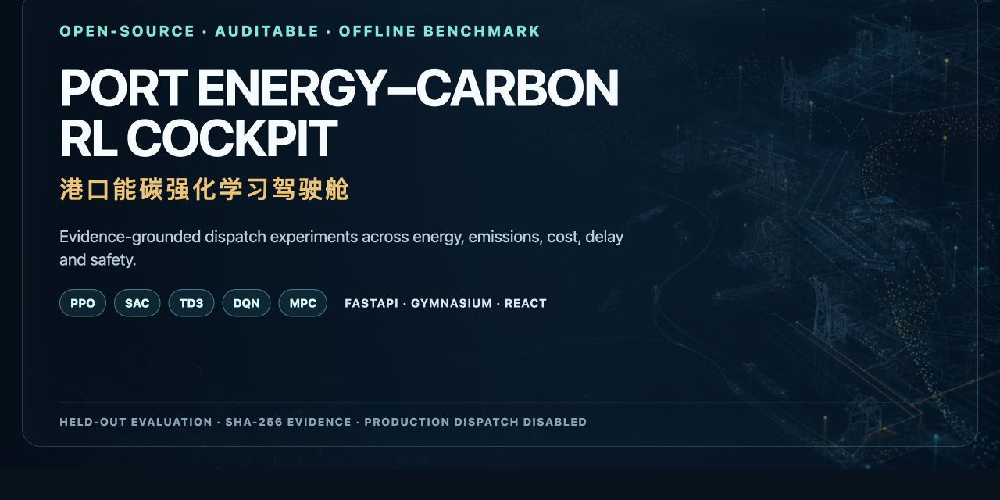
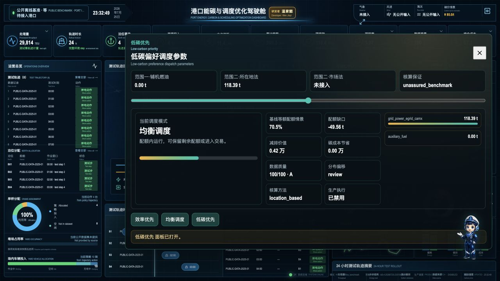
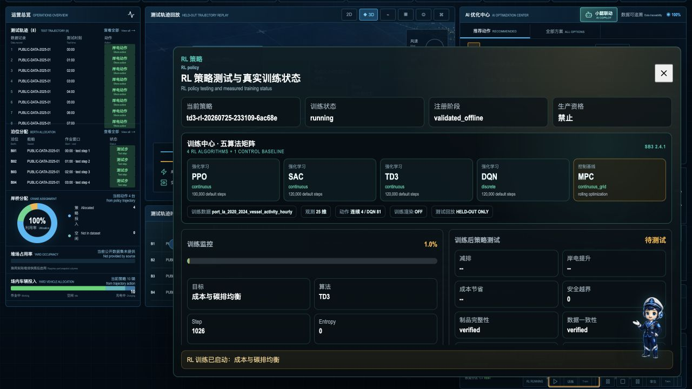
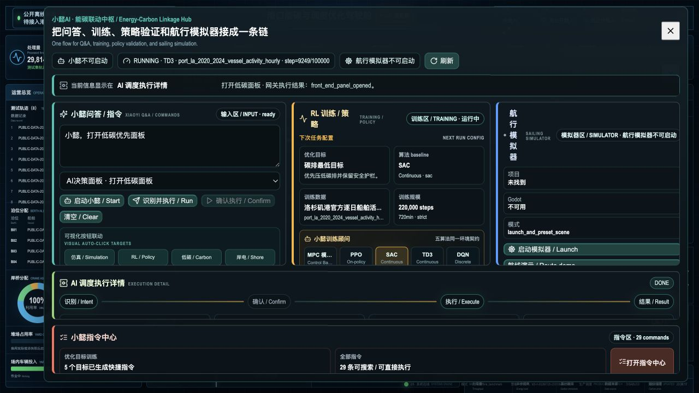
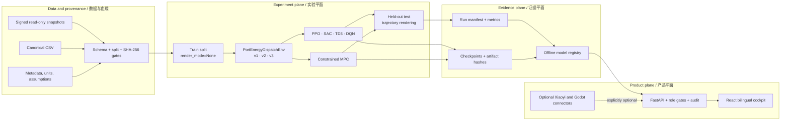

<p align="center">
  
</p>

<div align="center">

# 港口能碳实时模拟与智能调度驾驶舱

## Port Energy-Carbon Realtime Simulation & Intelligent Dispatch Cockpit

<strong>公开数据校准的实时数字孪生、预测、优化、审批、执行回执与审计系统</strong><br>
<strong>Public-data-calibrated realtime digital twin, forecast, optimization, approval, execution receipt and audit</strong>

<strong>独立研发者：</strong>温家懿 · <strong>Independent Developer:</strong> Wen Jiayi

[](https://github.com/wenjiayi123/port-energy-carbon-cockpit/actions/workflows/ci.yml)
[](https://github.com/wenjiayi123/port-energy-carbon-cockpit/actions/workflows/codeql.yml)
[](LICENSE)
[](backend/pyproject.toml)
[](frontend/package.json)
[](CHANGELOG.md)
[](docs/PRODUCTION_READINESS.md)

[快速开始 / Quick start](#快速开始--quick-start) · [可视验收 / Visual acceptance](docs/VISUAL_ACCEPTANCE_GUIDE.md) · [技术评审 / Review](docs/TECHNICAL_REVIEW_2026-08.md) · [系统架构 / Architecture](#系统架构--architecture) · [五类基线 / Baselines](#五类可执行基线--five-executable-baselines) · [数据契约 / Data](#替换港口数据--bring-your-own-port-data) · [可信边界 / Trust](#可信边界--trust-boundaries) · [参与贡献 / Contribute](CONTRIBUTING.md)

</div>

## 项目概览 / Project overview

| 项目要点 / Project fact | 已实现 / Implemented |
| --- | --- |
| 业务问题 | 在岸电、储能、光伏、暖通、充电、冷藏箱、作业服务与电网约束之间协同优化能耗、峰值、成本、碳排、延误和设备寿命。 |
| 系统架构 | `公开数据/历史数据 → 实时模拟器 → 质量门禁 → 数字孪生 → Ridge 预测 → MPC/SOP 对照 → 安全投影 → 双人审批 → 模拟执行 → 回执/KPI/审计链`。 |
| 实时模拟器 | 以洛杉矶港逐日船舶活动、EIA 电网/电价、eGRID 碳因子为校准底座，用守恒关系、设备状态机和工程约束生成稳定 `runtime-telemetry.v1`。 |
| 实港替换面 | 保留 TOS、AIS/VTS、PLC/SCADA、EMS、BMS、BA、电表和气象适配位；现场只替换适配器、字段映射和标定参数，不重写状态/动作/业务合同。 |
| 算法覆盖 | PPO、SAC、TD3、DQN、约束 MPC、风险感知 MPC 与当前状态 SOP 强基线；训练/验证/盲测按时间隔离，训练不渲染，测试才回放。 |
| 当前基准结果 | v4 公开数据因果留出评测相对固定满资源基线：碳排 `-8.792%` 、情景成本 `-8.094%`、峰值 `-2.983%`、约束满足 `100%`；不是现场 KPI。实时 Ridge 模型的 1h 终端负荷 held-out MAE 为 `416.493 kW`。 |
| 信任边界 | `simulation_mode=true`、`live_data_verified=false`、`dispatch_allowed=false`、`production_authority=false`；需求响应收益仅是未结算的工程估算。 |
| 本地运行 | 首次执行 `make bootstrap`，之后 `make demo`；驾驶舱 `http://127.0.0.1:5173/`，OpenAPI `http://127.0.0.1:8808/docs`，点击顶栏“实时闭环”体验完整流程。 |

> 系统已在公开数据校准的实时模拟环境中完成端到端闭环；数据合同、模型推理、安全投影、执行回执和审计链均可运行。接入真实港口时，主要工作是替换数据与设备适配器、完成现场标定、影子运行及生产验收。

接口字段与运行流程见 [Runtime data contract](docs/RUNTIME_DATA_CONTRACT.md) 和 [Closed-loop workflow](docs/CLOSED_LOOP_ACCEPTANCE.md)；版本变化记录在 [CHANGELOG](CHANGELOG.md)。

<table>
  <tr>
    <th align="center">公开小时电网数据<br /><sub>PUBLIC GRID HOURS</sub></th>
    <th align="center">留出测试<br /><sub>HELD-OUT TEST</sub></th>
    <th align="center">碳排<br /><sub>CARBON</sub></th>
    <th align="center">情景成本<br /><sub>SCENARIO COST</sub></th>
    <th align="center">约束与吞吐<br /><sub>CONSTRAINTS &amp; THROUGHPUT</sub></th>
  </tr>
  <tr>
    <td align="center"><strong>43,848 h / 1,238 d</strong><br />建模小时 / 官方逐日锚点</td>
    <td align="center"><strong>48 × 24 h</strong><br />1,152小时步 / hourly steps</td>
    <td align="center"><strong>−8.79%</strong><br />95% CI [−9.25%, −8.39%]</td>
    <td align="center"><strong>−8.09%</strong><br />因果留出评测 / causal held-out evaluation</td>
    <td align="center"><strong>100% / 99.98%</strong><br />约束满足 / 吞吐保持<br /><sub>constraints / throughput retention</sub></td>
  </tr>
</table>

<p align="center">
  <sub>v0.4.0 新增当前输入模型推理与模拟执行闭环；v0.3.0/v0.2.0 因果和历史指标继续冻结保留。</sub><br />
  <sub>v0.4.0 adds current-input inference and a simulation execution loop; the v0.3.0 and v0.2.0 evidence remains frozen.</sub>
</p>



> 截图来自增强公开数据包的留出测试轨迹和浏览器实测按钮联动。图中数值是可复现的离线场景输出，不是实时码头遥测、生产绩效或监管核证结果。<br>
> The screenshots show held-out replay from the enhanced public package and browser-verified button linkage. Values are reproducible offline scenario outputs—not live terminal telemetry, production performance, or regulatory assurance.

### 同屏证据 / Same-screen evidence

训练中心在同一画面展示四种 RL、MPC 控制基线、当前数据集、观测/动作契约，以及“训练不渲染、测试集才回放”的执行边界。



小懿训练顾问保留项目原有 Q 版海事形象，并把五算法、增强数据集、训练配置、真实进度与策略测试入口放在同一个联动中枢。浏览器验收实际点击“小懿 → 低碳”，动作网关返回成功并同步高亮对应按钮；执行详情保留识别、按钮/接口、确认、执行和结果证据。



## 项目定位 / Project position

本项目把港口能耗、岸电、设备资源、延误、成本与碳排放放进同一个约束环境，连接公开数据校准实时模拟、当前输入预测、策略安全投影、人工审批、模拟执行回执、强化学习训练、独立测试、模型治理与双语驾驶舱。每个关键数字都能回到数据分区、字段血缘、物理假设、算法动作和证据文件。

This project places port energy use, shore power, equipment allocation, delay, cost, and emissions inside one constrained environment. It connects dataset validation, reinforcement-learning training, a control-theory baseline, held-out evaluation, trajectory replay, model governance, and a bilingual cockpit. Its central goal is evidence: every important number should trace back to a split, a declared physical assumption, an algorithm action, and a persisted artifact.

### 为什么它不是普通大屏 / Why this is more than a dashboard

| 维度 / Dimension | 实际实现 / What is implemented |
| --- | --- |
| 实验内核 / Experiment core | Gymnasium v1/v2/v3/v4 分层合同：19 维能碳基准、25 维逐日船舶活动、35 维实港接入、48 维监管韧性；v1–v3 保持 4 维连续/81 离散，v4 增量为 6 维连续/729 离散。 / Layered 19/25/35/48-observation contracts; v1–v3 retain 4/81 actions while v4 adds two terminal-controlled inspection-recovery actions for 6/729. |
| 算法矩阵 / Algorithm matrix | PPO、SAC、TD3、DQN 四种 RL 算法，加四步有限时域约束 MPC。 / Four RL algorithms—PPO, SAC, TD3, DQN—plus a constrained four-step finite-horizon MPC baseline. |
| 训练边界 / Training boundary | `train` 无渲染拟合、`validation` 选型、完成后才在 `test` 生成轨迹。 / Non-rendering fit on `train`, selection on `validation`, and trajectory generation only during final `test` evaluation. |
| 证据链 / Evidence chain | 配置、随机种子、CSV/元数据/组合包 SHA-256、回调指标、checkpoint、模型哈希、测试与验证结果。 / Config, seed, CSV/metadata/package SHA-256, callback metrics, checkpoints, model hash, evaluation, and verification evidence. |
| 实港只读接入 / Read-only port integration | 六类 `port-snapshot.v1` 数据源必须通过逐源 HMAC、SHA-256、字段/单位、时效、序列与重放门禁。 / Six source families require per-adapter HMAC, SHA-256, schema/units, freshness, sequence and replay gates. |
| 风险评测 / Risk evaluation | 因果预测、配对 bootstrap 95% 区间、CVaR95、压力场景、备用裕度与动作稳定性。 / Causal forecasts, paired bootstrap 95% intervals, CVaR95, stress cases, reserve margin and action stability. |
| 碳核算 / Carbon accounting | 在历史范围一辅助燃油与所在地法范围二旁，新增远洋船、港作船、装卸设备、重型车辆、铁路、外购电力和固定燃烧七类港口清单；缺少活动数据、组织边界或合同凭证时保持不可用和核证阻断。 / A seven-source port inventory sits beside the legacy Scope 1 auxiliary-fuel and location-based Scope 2 view; missing activity, boundary, or contractual evidence stays unavailable and assurance-blocked. |
| 计量与核证 / Measurement and verification | 区分离线情景差值、现场计算值和独立复核值；执行项目计划、边界、基线、区间覆盖、校准、账单对账、调整、不确定性及 Ed25519 签名门禁。 / Separates offline scenario deltas, site calculations and independently reviewed values through plan, boundary, baseline, interval, calibration, reconciliation, adjustment, uncertainty and signature gates. |
| 碳资产与履约 / Carbon assets and compliance | 将情景碳价与真实账户分离；核验履约规则、登记簿账户、配额批次、交易与资金凭证、双人审批、余额对账、注销和 Ed25519 登记簿证明，并生成 SHA-256 链式账本。 / Separates scenario valuation from real accounts and validates program rules, registry ownership, allowance lots, trade/cash evidence, dual approval, reconciliation, retirement and signed registry attestation with a hash-chained ledger. |
| 能源与碳管理体系 / Energy and carbon management system | 以版本化证据合同执行 15 项计划—实施—检查—改进—独立保证门禁，覆盖方针、职责、能源评审、基准、能源绩效参数、目标、行动、监测、运行控制、能力、温室气体清单、内审、纠正措施和管理评审；即使全通过也不宣称获得 ISO 认证。 / A versioned 15-gate PDCA and independent-assurance contract covers policy, roles, energy review, baselines, EnPIs, objectives, action plans, monitoring, operational controls, competence, GHG inventory, internal audit, corrective action and management review; passing never claims ISO certification. |
| 业务—能量联合计划 / Joint operations-energy planning | 以具名船舶、泊位、岸桥、堆场、集卡预约、冷藏箱、岸电和能源管理八源数据执行联合排程与储能优化；逐源 Ed25519 签名、时效对齐、12 项硬门禁和 SHA-256 回执失败关闭，结果只供人工复核和影子运行。 / Named vessel, berth, crane, yard, truck, reefer, shore-power and EMS records feed joint scheduling and storage optimization; per-source Ed25519 signatures, freshness alignment, 12 hard gates and SHA-256 receipts fail closed, and output remains advisory-only. |
| 港航生态协同 / Ship-port ecosystem collaboration | 以船公司、港口调用、码头泊位、岸电、替代燃料、港口费和走廊治理七源证据，核验准时到港、绿色泊位、岸电预约计费、替代燃料准备度、费率激励及船港减排收益分配；15 项闸门失败关闭且不授予船速、泊位、合闸、加注、开票或资金权限。 / Seven signed vessel-operator, port-call, terminal, shore-power, alternative-fuel, tariff and corridor-ledger domains verify JIT arrival, green berths, shore-power reservation/billing, fuel readiness, fee incentives and shared abatement value through 15 fail-closed gates without operational or financial authority. |
| 企业平台与运行技术安全 / Enterprise platform and OT security | 新增可执行 OpenID Connect Ed25519 令牌、签发方/受众/时效/多因素校验、具名主体、角色映射和签名租户隔离；九类独立安全证据覆盖消息/时序、高可用、灾备、WORM/SIEM、双向 TLS、密钥轮换、运行技术分区与独立安全联锁，以 20 项门禁失败关闭。 / Executable OIDC EdDSA validation, named subjects, role mapping and signed tenant isolation sit beside a nine-domain, 20-gate evidence contract for messaging/time-series, HA/DR, WORM/SIEM, mTLS/key rotation, OT zoning and independent safety interlocks. |
| 配电数字孪生 / Electrical network digital twin | 以具名母线、馈线、变压器、开关和电源执行辐射潮流、电压/无功/谐波、热老化、N-1、孤岛、充电排队及储能质保评估；六源 Ed25519 签名、14 项门禁和 SHA-256 回执失败关闭，不具备倒闸或保护整定权限。 / Named buses, feeders, transformers, switches and sources feed radial power flow, voltage/reactive/harmonic, thermal-aging, N-1, island, charging-queue and storage-warranty assessment; six-source Ed25519 signatures, 14 fail-closed gates and SHA-256 receipts never grant switching or protection-setting authority. |
| 算法生产资格 / Algorithm production qualification | 不新增算法；用六类独立签名证据和 15 项失败关闭门禁，统一校验多种子、跨四季、概率标定、分布外回退、解释保真、动作可达、P95/P99 时延、故障注入、人工否决、冠军/挑战者区间、安全不退化和长周期影子运行；自动晋级和自主下发始终禁用。 / Six independently signed evidence domains and 15 fail-closed gates qualify existing algorithms across seeds, seasons, calibration, OOD, explanations, reachability, latency, faults, vetoes, paired confidence intervals, safety and shadow duration; automatic promotion and autonomous dispatch remain disabled. |
| 安全边界 / Safety boundary | 生产调度硬编码禁用；外部连接器可选；变更接口需要角色权限和人工确认。 / Production dispatch is hard-disabled; external connectors are optional; mutation routes require role gates and explicit confirmation. |

## 可见系统 / What you can inspect

### 1. 留出轨迹驾驶舱 / Held-out trajectory cockpit

- 24 步测试轨迹、吞吐、岸桥/场内车辆动作、峰值负荷、能耗、范围一与范围二排放、成本与安全越界。
- 基线与策略对比来自同一环境、同一数据包与同一测试分区。
- 缺失的气象、AIS、TOS、堆场占用、AGV 电池与可再生能源结构直接显示“未接入”，不会生成展示性数字。

- A 24-step held-out trajectory with throughput, crane and yard-vehicle actions, peak load, energy, Scope 1/2 emissions, cost, and safety violations.
- Baseline and policy comparisons share the same environment, dataset package, and test partition.
- Missing weather, AIS, TOS, yard occupancy, AGV battery, and renewable-mix fields remain visibly unavailable instead of being fabricated.

### 2. 模型与联动治理 / Model and integration governance


治理面板区分驾驶舱、真实 learner 运行时、小懿 AI、本地航行模拟器和 Godot 执行环境。首次克隆时，只有仓库内能力显示就绪；未配置的外部桌面项目会明确离线。<br>
The governance panel separates the cockpit, real learner runtime, Xiaoyi AI, the local sailing simulator, and the Godot runtime. On a clean clone, only repository-owned capabilities report ready; unconfigured desktop integrations remain explicitly offline.

## 系统架构 / Architecture



| 层 / Layer | 技术 / Technology | 职责 / Responsibility |
| --- | --- | --- |
| 数据层 / Data | Pandas, canonical CSV, JSON metadata | 字段、单位、来源、分区、质量与漂移校验 / schema, units, provenance, split, quality, drift |
| 接入层 / Integration | Pydantic, HMAC-SHA256, atomic JSON state | 六源只读快照、时效、幂等、重放防护与就绪证据 / six-source read-only snapshots, freshness, idempotency, replay protection, readiness |
| 环境层 / Environment | Gymnasium, NumPy | 逐小时负荷、资源、排放、成本、延误与安全约束 / hourly load, resources, emissions, cost, delay, safety |
| 学习层 / Learning | Stable-Baselines3, PyTorch | 四种真实 learner、回调、暂停/恢复/停止与 checkpoint / four real learners, callbacks, controls, checkpoints |
| 对照层 / Control | constrained beam-search MPC | 可解释非 RL 基线 / interpretable non-RL baseline |
| 服务层 / Service | FastAPI, Pydantic | 实验、注册表、健康、指标、权限与审计 API / experiment, registry, health, metrics, authorization, audit APIs |
| 表现层 / Interface | React, TypeScript, Vite | 双语轨迹、场景推演、模型治理与可选联动 / bilingual trajectories, scenarios, governance, optional integrations |

## 五类可执行基线 / Five executable baselines

| ID | 家族 / Family | 动作空间 / Action space | 项目中的角色 / Role in this repository |
| --- | --- | --- | --- |
| `ppo` | RL | continuous | 裁剪策略梯度，用于连续资源配置。 / Clipped policy-gradient baseline for continuous allocation. |
| `sac` | RL | continuous | 熵正则离策略 actor-critic，适合岸电和设备比例。 / Entropy-regularized off-policy actor-critic for shore-power and equipment ratios. |
| `td3` | RL | continuous | 双评论家与延迟策略更新，强调平滑连续控制。 / Twin critics and delayed updates for smooth continuous control. |
| `dqn` | RL | 81 discrete presets | 在 3×3×3×3 可审计岸电、岸桥、场内车辆与储能组合上做值学习。 / Value learning over an auditable 3×3×3×3 shore-power, crane, yard and storage grid. |
| `mpc` | control theory | constrained beam search | 四步有限时域、宽度 4 的约束束搜索；默认驾驶舱的可复现对照。 / Four-step constrained beam search with width 4; the reproducible default cockpit comparator. |

四种 RL 算法均通过 Stable-Baselines3 的实际 `learn()` 路径运行；仓库测试对每个 learner 执行最小 smoke run。smoke run 只证明管线可执行，不代表策略已收敛或优于基线。<br>
All four RL algorithms execute the actual Stable-Baselines3 `learn()` path, and the test suite performs a minimal smoke run for each learner. A smoke run proves pipeline executability—not convergence or superiority.

v0.3.0 另加一个不计入“五类基线”数量的部署安全层：六步、宽度 8 的风险感知 MPC，在同一动作合同上联合惩罚低电网备用裕度、尾部排队、延误、SOC 偏离、动作跳变和电池投影量。它用于压力测试和策略资格审查，不会把原有 MPC 重新命名成新的训练算法。<br>
v0.3.0 adds a deployment safety layer that is not counted as a sixth baseline: a six-step, width-8 risk-aware MPC over the same action contract. It penalizes low grid reserve, tail queues, delay, SOC deviation, action slew and battery projection. It qualifies policies rather than relabelling the published MPC.

### 环境状态与目标 / Environment state and objective

v1 的 19 维观测覆盖需求/预测、碳因子、电价、积压、电网余量、储能、时间、货类及累计指标；v2 再加入 6 项港口活动信号；实港 v3 加入天气、泊位/设备/电网可用率、岸电兼容和可再生能源 10 项输入。新增 v4 在 v3 上再加入海事检查、海关检查、外生放行、资料/资源准备度、预计扣留时长以及三类状态队列，共 48 维；新增动作仅为码头可控的检查准备度和放行恢复优先级。检查选择、扣留和正式放行始终是外生信号，策略无监管决定权。

v1 exposes 19 energy-dispatch observations; v2 adds six vessel-activity signals; v3 adds ten deployment inputs. v4 reaches 48 observations by adding maritime/customs inspection, exogenous release, readiness, expected-hold and stateful queue signals. Its two new actions control terminal readiness and post-release recovery only; inspection, detention and official release remain outside policy authority.

### 海事/海关检查延误的能碳传导 / Regulatory-delay energy-carbon resilience

v4 显式建模“检查到达 → 海事/海关扣留队列 → 正式放行 → 码头恢复队列 → 岸桥/堆场追赶 → 负荷、峰值、成本和碳排”的后续链条。业务边界依据 [IMO Port State Control](https://www.imo.org/en/ourwork/iiis/pages/port%20state%20control.aspx) 与 [U.S. CBP intensive examination hold/release guidance](https://www.help.cbp.gov/s/article/Article-1268?language=en_US)：策略不能改变机关检查或放行，只能准备码头资源并安排放行后的恢复。

三轮真实 SAC 训练均版本化保留：v1 全动作学习和 v2 简单门控未通过准入门；v3 冻结原四动作，以旧策略恢复服务量为下限，只学习额外恢复提案，并用最小准备能耗投影执行。在首次读取的冻结 2025 final challenge（48 个 24 小时窗口）上，v3 相对保留旧策略降低情景成本 **0.666%**（95% CI **0.6452%–0.6843%**）、碳排 **0.688%**、峰值 **0.601%**，同时总延误、监管链延误、吞吐和安全均不退化。完整证据见 [v3 report](reports/regulatory_resilience_v3.md)，v1/v2 失败结果也原样公开。

这些结果是预声明监管压力情景，不是海事局、海关或码头现场 KPI；`simulation_mode=true`、`live_data_verified=false`、`dispatch_allowed=false`、`production_authority=false`。

## 可审计实验生命周期 / Auditable experiment lifecycle

```text
dataset validation
  -> immutable train/validation/test split
  -> non-rendering fit on train
  -> validation-only tuning + checkpoints
  -> artifact SHA-256
  -> one-way held-out test rollout
  -> drift, integrity, and safety gates
  -> candidate / validated_offline / verified_offline / blocked
  -> production_eligible = false
```

每个新 run 写入 `backend/app/data/runs/<job-id>/`，但运行目录和二进制模型默认不进入 Git。源码仓库保持轻量；需要公开的 benchmark 模型与结果应作为独立 release artifact 发布。<br>
Each new run is written to `backend/app/data/runs/<job-id>/`, while run outputs and binary models are ignored by Git. The source repository stays lightweight; benchmark models and results should be published as separate release artifacts.

| 证据文件 / Evidence | 内容 / Contents |
| --- | --- |
| `config.json` | 完整解析后的算法、数据、哈希、seed、超参数与边界 / resolved algorithm, data, hashes, seed, hyperparameters, boundaries |
| `metrics.jsonl` | learner callback 与非渲染验证指标 / learner callback and non-rendering validation metrics |
| `checkpoints/` | 基于真实 step 的阶段 checkpoint / measured-step checkpoints |
| `model.zip` / `mpc_policy.json` | 模型或控制器产物 / model or controller artifact |
| `manifest.json` | 生命周期、时长、产物路径与哈希 / lifecycle, duration, artifact reference and hash |
| `evaluation.json` | 留出集指标和可视化轨迹 / held-out metrics and trajectory |
| `verification.json` | 离线验证门槛与结论 / offline verification gates and outcome |

## 数据与碳核算 / Data and carbon accounting

仓库保留两个互补数据包。52,608 小时长周期基准组合了四类公开来源：

1. [Port of Los Angeles 2020–2025 container statistics](https://www.portoflosangeles.org/business/statistics/container-statistics)：72 条官方月度 TEU；2020–2023 年训练、2024 年验证、2025 年全年留出测试。
2. [U.S. EIA monthly retail electricity prices](https://www.eia.gov/opendata/documentation.php)：同期加州商业部门月均电价，作为每月均值锚点。
3. [EIA Hourly Electric Grid Monitor](https://www.eia.gov/electricity/gridmonitor/about/)：LADWP 2020–2025 小时用电与消费侧碳强度；52,608 小时中 51,726 小时为报告值，882 小时按月-小时中位数插补并保留质量码，原始覆盖率 98.32%。
4. [U.S. EPA eGRID CAMX](https://www.epa.gov/egrid/summary-data)：作为年度区域因子交叉检查。

The default benchmark combines four public-source families:

1. [Port of Los Angeles 2020–2025 container statistics](https://www.portoflosangeles.org/business/statistics/container-statistics): 72 official monthly TEU observations, with 2020–2023 for training, 2024 for validation, and all of 2025 held out for testing.
2. [U.S. EIA monthly retail electricity prices](https://www.eia.gov/opendata/documentation.php): California commercial-sector monthly means used as price anchors.
3. [EIA Hourly Electric Grid Monitor](https://www.eia.gov/electricity/gridmonitor/about/): LADWP hourly demand and consumed carbon intensity for 2020–2025; 51,726 of 52,608 hours are reported and 882 are quality-coded month-hour median imputations, for 98.32% source coverage.
4. [U.S. EPA eGRID CAMX](https://www.epa.gov/egrid/summary-data): an annual regional cross-check.

新训练默认使用 `port_la_2020_2024_vessel_activity_hourly`：在同一版本化能碳底座上加入洛杉矶港 Wharfinger Division 2020–2024 年 1,238 条官方工作日锚泊、靠泊、离港与在港时间记录。它包含 43,848 个连续小时；2020–2022 训练、2023 验证、2024 留出测试。非报告日明确标记为线性插值，不冒充逐小时港口遥测。旧数据包和原指标完整保留，作为更长的能碳证据基线。完整比较见 [dataset credibility report](reports/dataset_credibility_comparison.md)。

New training defaults to `port_la_2020_2024_vessel_activity_hourly`, which adds 1,238 official Port of Los Angeles Wharfinger Division business-day anchor, berth, departure, and dwell observations to the versioned energy-carbon base. Its 43,848 contiguous hours use 2020–2022 for training, 2023 for validation, and 2024 for held-out testing. Non-reporting days are explicitly marked interpolations, not hourly terminal telemetry. The original package and metrics remain intact as the longer energy-carbon baseline.

月度 TEU 通过公开的确定性曲线分配到小时；LADWP 商业分时电价时段只用于形成日内形状，并归一回 EIA 月均电价。该价格仍是情景代理而非港口账单，设备容量、负荷、储能与延误成本是元数据中声明的模型参数。完整来源、单位、插补、转换与哈希见 [数据卡](docs/DATA_CARD.md) 和 [dataset metadata](backend/app/data/datasets/port_la_2020_2025_hourly.metadata.json)。<br>
Monthly TEU is allocated to hours through a disclosed deterministic profile. LADWP commercial time-of-use periods provide only the intraday shape, rescaled to each EIA monthly mean. Prices remain scenario proxies rather than terminal bills; equipment, storage and delay parameters are declared model assumptions. See the [data card](docs/DATA_CARD.md) and [dataset metadata](backend/app/data/datasets/port_la_2020_2025_hourly.metadata.json).

在覆盖 2025 全年的 48 个确定性留出窗口、共 1,152 个小时仿真步上，四步约束 MPC 相对“全岸电+固定满配装卸资源”强基线降低能耗 <strong>8.4%</strong>、碳排 <strong>8.7%</strong>、情景成本 <strong>7.9%</strong>、峰值负荷 <strong>3.2%</strong>，设备平均启用比例降低 <strong>28.8%</strong>，吞吐保持率 <strong>99.97%</strong>、约束满足率 <strong>100%</strong>；三组预声明目标权重下碳排改善区间为 <strong>8.69%–8.74%</strong>。这是公开数据离线情景结果，不是港口实测 KPI，也不证明 RL 优于 MPC；完整分母、采样索引、限制和哈希见 [benchmark report](reports/offline_benchmark_v3.md)。

Across 48 deterministic held-out windows spanning 2025—1,152 simulated hourly steps—the four-step constrained MPC reduces energy by <strong>8.4%</strong>, carbon by <strong>8.7%</strong>, scenario cost by <strong>7.9%</strong>, and peak load by <strong>3.2%</strong> against the strong “full shore power + fixed fully staffed cargo resources” baseline. Mean equipment activation falls <strong>28.8%</strong>, throughput retention is <strong>99.97%</strong>, and constraint satisfaction is <strong>100%</strong>. Three predeclared objective-weight settings yield a carbon-improvement range of <strong>8.69%–8.74%</strong>. These are public-data offline scenario results, not measured terminal KPIs, and they do not show RL superiority over MPC. See the [benchmark report](reports/offline_benchmark_v3.md) for denominators, sample indices, limits, and hashes.

以上 v0.2.0 指标继续作为冻结的 legacy perfect-forecast 情景证据：窗口内后续行曾作为确定性预测输入；它们不是 v0.3.0 的因果上线指标。The v0.2.0 metrics above remain frozen legacy perfect-forecast scenario evidence: later rows within a window were available as deterministic forecast inputs. They are not the v0.3.0 causal deployment metrics.

报告同时给出更严格的对照：仅用 2024 验证集从 9 个静态资源配置中选择
80%/80% 岸桥与场内车辆比例，冻结后在 2025 测试。MPC 相对该基线仍降低
碳排 <strong>2.84%</strong>、能耗 <strong>2.52%</strong>、成本 <strong>2.08%</strong>，吞吐提高 <strong>0.85%</strong>，
但峰值负荷增加 <strong>3.38%</strong>。这组结果用于披露算法边际收益与多目标代价，不替代
上方“减少固定满配冗余”的场景口径。

The report also publishes a harder comparator: select an 80%/80% crane/yard-vehicle static configuration from nine candidates using only 2024 validation data, freeze it, and test in 2025. Against that comparator, MPC still reduces carbon by <strong>2.84%</strong>, energy by <strong>2.52%</strong>, and cost by <strong>2.08%</strong>, while increasing throughput by <strong>0.85%</strong>—but peak load rises <strong>3.38%</strong>. This result discloses marginal algorithm benefit and the multi-objective trade-off; it does not replace the full-resource redundancy scenario above.

逐日船舶活动增强集的原 v0.2.0 独立报告同样覆盖 48×24 个 2024 留出小时窗口：相对固定满配强基线，MPC 碳排降低 <strong>8.90%</strong>、情景成本降低 <strong>8.22%</strong>、吞吐保持 <strong>100.00%</strong>、约束满足 <strong>100%</strong>；相对验证集选择的 80%/80% 更严格基线，碳排仍降低 <strong>2.77%</strong>、成本降低 <strong>2.11%</strong>，但峰值增加 <strong>3.61%</strong>。见 [enhanced benchmark](reports/offline_benchmark_vessel_activity_v1.md)。该历史协议允许 MPC 读取窗口内后续行作为确定性预测，因此保留为 legacy perfect-forecast 场景证据，不再作为因果上线指标。

The original v0.2.0 vessel-activity report evaluates 48×24 held-out hours from 2024. MPC reduces carbon by <strong>8.90%</strong> and scenario cost by <strong>8.22%</strong> versus the fixed full-resource comparator, with <strong>100.00%</strong> throughput retention and <strong>100%</strong> constraint satisfaction. Against the harder validation-selected 80%/80% comparator, carbon still falls <strong>2.77%</strong> and cost <strong>2.11%</strong>, while peak load rises <strong>3.61%</strong>. That historical protocol lets MPC consume later rows within the window as a deterministic forecast; it remains preserved as legacy perfect-forecast scenario evidence, not the causal deployment metric.

### v0.4.0 实时闭环证据 / Realtime closed-loop evidence

v0.4.0 新增确定性的公开数据校准模拟器：以 `port_la_2020_2024_vessel_activity_hourly` 测试分区为底座，每步按港口作业、能量守恒、储能 SOC/SOH/温度/循环衰减、变压器容量、岸电服务、AGV 备用和设备状态机更新。非公开现场字段明确标为 `物理模拟` 或 `工程派生`，不冒充实测。

多输出 Ridge 模型仅使用 `train` 拟合、`validation` 选 alpha，并保留 `test` 评测；1/3/6h 终端负荷 held-out MAE 分别是 <strong>416.493 / 507.028 / 479.823 kW</strong>。运行 MPC 的 135 个当前状态候选与 SOP 强基线对照后，经动作白名单、SOC/温度/变压器/服务约束投影、请求人禁止自审和双人审批，才能进入模拟执行器。回执持久化 ACK、快照/模型/数据哈希、KPI 前后变化、失败/回滚原因和 SHA-256 审计链。

可复现模型证据见 [`runtime_forecast_model_v1.json`](reports/runtime_forecast_model_v1.json)；完整 API 步骤见 [`CLOSED_LOOP_ACCEPTANCE.md`](docs/CLOSED_LOOP_ACCEPTANCE.md)；`GET /api/evidence/history` 同时返回 v0.2/v0.3/v0.4 证据和被拒绝的 TD3 候选。这些是实时模拟和公开数据离线证据，不授权生产控制。

### v0.3.0 因果鲁棒性增量 / Causal robustness increment

新的 [v4 港口落地评测](reports/port_landing_benchmark_v4.md) 保持相同 48×24 留出窗口，但在每个决策时刻禁止读取后续测试行。风险感知 MPC 相对固定满配强基线降低能耗 <strong>8.726%</strong>、碳排 <strong>8.792%</strong>、情景成本 <strong>8.094%</strong>、峰值 <strong>2.983%</strong>，吞吐变化 <strong>−0.017%</strong>、约束满足率 <strong>100%</strong>；碳排改善的配对 bootstrap 95% 区间为 <strong>8.387%–9.249%</strong>。

相对同样使用因果持久性预测的旧 MPC，风险层把平均延误降低 <strong>43.880%</strong>、P95 队列降低 <strong>47.858%</strong>、动作总变差降低 <strong>25.444%</strong>，三类压力场景均保持 <strong>100%</strong> 零建模安全违规；代价是平均碳排增加 <strong>0.156%</strong>、成本增加 <strong>0.191%</strong>、峰值增加 <strong>0.394%</strong>，且电网降额压力下软备用裕度违约步数增加 <strong>7.692%</strong>。这是一组可审计的稳定性—效率权衡，不是全面优于旧 MPC 的宣传。

The [v4 port-landing benchmark](reports/port_landing_benchmark_v4.md) keeps the same 48×24 held-out windows while making later test rows unavailable at each decision. Against fixed full resources, the risk-aware MPC reduces energy by <strong>8.726%</strong>, carbon by <strong>8.792%</strong>, scenario cost by <strong>8.094%</strong>, and peak by <strong>2.983%</strong>; throughput changes by <strong>−0.017%</strong>, constraint success is <strong>100%</strong>, and the paired-bootstrap 95% interval for carbon reduction is <strong>8.387%–9.249%</strong>.

Against the causal legacy MPC, it reduces mean delay by <strong>43.880%</strong>, P95 queue by <strong>47.858%</strong>, and action total variation by <strong>25.444%</strong>, with zero modelled safety violations in all three stress families. The measured trade-off is <strong>+0.156%</strong> mean carbon, <strong>+0.191%</strong> cost, <strong>+0.394%</strong> peak, and <strong>+7.692%</strong> soft reserve-breach steps under grid derating. These negative entries are deliberately retained.

## 快速开始 / Quick start

### 本地开发 / Local development

要求：Python 3.11+、Node.js 20+、pnpm。首次安装 PyTorch 可能需要数分钟。Intel macOS 已无受支持的新版 PyTorch wheel，因此该平台保留因果 MPC、回放与 API，但安装脚本不会启用神经网络训练；Linux 或 Apple Silicon 承担 PPO/SAC/TD3/DQN 训练。<br>
Requirements: Python 3.11+, Node.js 20+, and pnpm. The first PyTorch installation may take several minutes. Patched current PyTorch wheels are unavailable for Intel macOS, so that host keeps causal MPC, replay and the API but does not enable neural training; use Linux or Apple Silicon for PPO/SAC/TD3/DQN.

```bash
git clone https://github.com/wenjiayi123/port-energy-carbon-cockpit.git
cd port-energy-carbon-cockpit
make bootstrap
make demo
```

- 驾驶舱 / Cockpit: `http://127.0.0.1:5173/`
- OpenAPI: `http://127.0.0.1:8808/docs`
- Readiness: `http://127.0.0.1:8808/api/health/ready`
- Metrics: `http://127.0.0.1:8808/api/metrics`
- Runtime snapshot: `http://127.0.0.1:8808/api/runtime/snapshot`
- Forecast evidence: `http://127.0.0.1:8808/api/runtime/forecast/model`
- Versioned evidence history: `http://127.0.0.1:8808/api/evidence/history`

驾驶舱顶部点击“实时闭环”，依次查看连续字段、1/3/6h 预测、生成当前推荐、两名不同审批人确认、模拟执行回执、KPI 变化和回滚；再注入“通信失联”验证预测/决策失败关闭，最后点击“复位”。

### 加固容器 / Hardened containers

```bash
export OPERATOR_API_KEY="$(openssl rand -hex 24)"
make docker-up
```

Compose 将前后端绑定到 loopback，后端生产模式强制 API key 或 OIDC；OIDC 模式执行 EdDSA 令牌、签发方、受众、时间、多因素、具名角色和签名租户校验。容器使用非 root 用户、只读文件系统、全部 capability drop 和独立 run/audit volume。面向互联网和运行技术网络时仍需由部署方提供身份入口、双向 TLS、外部 WORM/SIEM、高可用、灾难恢复和独立安全联锁。<br>
Compose binds both services to loopback and requires API-key or OIDC authentication in production. OIDC validates EdDSA tokens, issuer, audience, time, MFA, named roles and signed tenant claims. Containers remain non-root, read-only and capability-free; the deployer must still provide the identity ingress, mTLS, external WORM/SIEM, HA/DR and independent OT interlock.

## 可复现实验 / Reproducible experiments

```bash
cd backend

# 列出四种 RL 与 MPC / list four RL algorithms plus MPC
.venv/bin/python -m app.rl.cli algorithms

# 验证数据契约和哈希 / validate dataset contract and hashes
.venv/bin/python -m app.rl.cli validate-data port_la_2020_2024_vessel_activity_hourly

# 仅在 train 上训练，不渲染 / fit on train only, without rendering
.venv/bin/python -m app.rl.cli train \
  --algorithm sac \
  --dataset port_la_2020_2024_vessel_activity_hourly \
  --total-steps 120000 \
  --seed 20260720

# 训练完成后才在 test 上评估并生成轨迹 / held-out evaluation after fitting
.venv/bin/python -m app.rl.cli evaluate --strategy auto:latest

# 仅用validation选型 / tune on validation only; short runs must be marked smoke
PYTHONPATH=. .venv/bin/python -m app.rl.tuning \
  --algorithm all \
  --dataset port_la_2020_2024_vessel_activity_hourly \
  --steps 10000 \
  --final-seeds 11,29,47 \
  --output ../reports/rl_tuning_vessel_activity_10k.json

# 重算公开MPC报告 / recompute and verify the publishable MPC report
PYTHONPATH=. .venv/bin/python -m app.rl.benchmark run
PYTHONPATH=. .venv/bin/python -m app.rl.benchmark \
  verify ../reports/offline_benchmark_v3.json

# 在仓库根目录重建逐日船舶活动数据并复算增强报告
cd ..
make data-enhanced
make benchmark-enhanced
make verify-benchmark-enhanced

# 复算不偷看未来测试行的 v4 指标 / recompute causal v4 evidence
make landing-benchmark
make verify-landing-benchmark
```

API 启动训练需要 `confirm=true`。训练进度来自 `model.num_timesteps`、callback 指标和实际耗时；ETA 使用已测 step rate 推导，不使用固定时长计时器。<br>
API training requires `confirm=true`. Progress comes from `model.num_timesteps`, callback metrics, and measured elapsed time; ETA is derived from observed step rate, not a fixed-duration timer.

The enhanced package also includes a reproducible
[10k multi-seed RL matrix](reports/rl_tuning_vessel_activity_10k.md): all four
learners completed real fit/validation/test execution with zero modeled safety
violations across the reported seeds. It is explicitly labelled short-budget
comparative evidence, not convergence or production performance.

A separate [100k TD3 run](reports/rl_td3_vessel_activity_100k/README.md)
is intentionally retained as rejected evidence: its split/artifact/safety
checks passed, but it underperformed both constrained-control and fixed-resource
comparators on carbon and scenario cost. It is not used as a positive metric.

## 替换港口数据 / Bring your own port data

算法不绑定洛杉矶港。使用稳定 canonical schema 和相邻 metadata 即可替换数据，而不改 learner 或驾驶舱。完整字段、单位与时序模式见 [docs/DATASETS.md](docs/DATASETS.md)，模板见 [docs/examples/port_dataset_template.csv](docs/examples/port_dataset_template.csv)。<br>
Algorithms are not hard-coded to Los Angeles. Replace the data through the stable canonical schema and adjacent metadata without modifying the learner or cockpit. See [docs/DATASETS.md](docs/DATASETS.md) and the [CSV template](docs/examples/port_dataset_template.csv).

```bash
python scripts/prepare_port_dataset.py \
  --input /path/to/tos_ems_export.csv \
  --output backend/app/data/datasets/my_port.csv \
  --temporal-mode sequential_rows \
  --time-col observed_at_utc \
  --environment-id PortEnergyDispatchEnv-v3 \
  --port-id my_port \
  --timezone Asia/Kuala_Lumpur \
  --currency MYR \
  --source-id my_port_snapshot \
  --source-url https://data-owner.example/evidence/snapshot \
  --license proprietary-authorized

cd backend
.venv/bin/python -m app.rl.cli validate-data my_port
```

- v3 的字段映射选项见 `python scripts/prepare_port_dataset.py --help`；缺少天气、泊位/设备/电网可用率、岸电兼容或可再生能源字段会 fail closed。完整流程见 [实港接入蓝图](docs/PORT_INTEGRATION_BLUEPRINT.md)。 / See the mapper help and the [real-port blueprint](docs/PORT_INTEGRATION_BLUEPRINT.md); missing v3 deployment fields fail closed.
- `profiled_period`：适合公开月度/聚合 benchmark，按声明曲线构造 episode。 / for aggregate public benchmarks with a declared profile.
- `sequential_rows`：适合只读 TOS/EMS 小时快照，环境按不可变行推进。 / for immutable hourly TOS/EMS snapshots advanced row by row.
- CLI 可读取操作者明确提供的外部 CSV；HTTP API 只允许仓库已注册的数据集 ID，阻断任意文件路径访问。 / The CLI may read operator-supplied external CSV files; HTTP endpoints accept only registered dataset IDs and reject arbitrary filesystem paths.

## API 表面 / API surface

| Endpoint | 方法 / Method | 语义 / Semantics |
| --- | --- | --- |
| `/api/dashboard/snapshot` | GET | 当前公开 benchmark 与测试轨迹快照 / current benchmark and held-out snapshot |
| `/api/dashboard/measurement-verification` | GET | 当前节能减排计量核证状态；默认现场核证值为空 / current M&V state; field-verified values are empty by default |
| `/api/dashboard/measurement-verification/evaluate` | POST | 评估现场计划、计量、基线、调整、不确定性与 Ed25519 独立复核证据 / evaluate site plan, metering, baseline, adjustments, uncertainty and signed independent-review evidence |
| `/api/dashboard/carbon-assets` | GET | 当前碳资产履约状态；情景估值与核证账户头寸严格分离 / current carbon-asset compliance state with scenario valuation separated from verified account positions |
| `/api/dashboard/carbon-assets/evaluate` | POST | 核验登记簿账户、批次、交易、资金、审批、注销、对账和签名证明 / validate registry account, lots, trades, cash, approvals, retirement, reconciliation and signed attestation |
| `/api/dashboard/commercial-settlement` | GET | 商业结算失效关闭状态；情景电价和工程收益不进入核证值 / fail-closed commercial state; scenario tariff and engineering value stay outside verified values |
| `/api/dashboard/commercial-settlement/evaluate` | POST | 核验八源签名并重构电力账单、市场结算、绿证、租户分摊、回收期与边际减排成本 / validate eight signed sources and reconcile bills, market settlements, certificates, tenant allocations, payback and MACC |
| `/api/dashboard/port-collaboration` | GET | 港航生态协同失效关闭状态；公开船舶活动与岸电情景不进入核证值 / fail-closed ship-port collaboration state; public vessel and shore-power scenarios stay outside verified values |
| `/api/dashboard/port-collaboration/evaluate` | POST | 核验七源签名并重算准时到港、绿色泊位、岸电、替代燃料、绿色费率与船港收益分配 / validate seven signed domains and reconcile JIT arrival, green berths, shore power, alternative fuel, green fees and shared benefits |
| `/api/dashboard/enterprise-security` | GET | 仓库控制与现场企业/运行技术安全证据分列；默认 0/9 源域、0/20 门禁 / repository controls separated from site enterprise/OT evidence; 0/9 domains and 0/20 gates by default |
| `/api/dashboard/enterprise-security/evaluate` | POST | 核验九源签名、身份租户、消息时序、高可用灾备、WORM/SIEM、PKI 和运行技术安全演练 / validate nine signed domains across identity, tenancy, messaging, time-series, HA/DR, WORM/SIEM, PKI and OT exercises |
| `/api/dashboard/site-cutover-readiness` | GET | 汇总十三个实施域，默认仅显示仓库证据且阻断现场投产 / aggregate thirteen implementation domains while keeping site cutover blocked by default |
| `/api/dashboard/site-cutover-readiness/evaluate` | POST | 核验十三域、180 天影子运行、演练、回滚和六方绑定签字 / validate thirteen signed domains, 180-day shadow evidence, drills, rollback and six bound approvals |
| `/api/security/context` | GET | 返回当前具名主体、角色、允许/选定租户和认证方式，不返回令牌 / return the named subject, role, allowed/selected tenant and authentication method without token material |
| `/api/dashboard/energy-carbon-management` | GET | 当前能源与碳管理体系证据闭环状态；公开离线场景默认 0/15 阻断 / current management-system evidence readiness; the public offline scenario is blocked at 0/15 by default |
| `/api/dashboard/energy-carbon-management/evaluate` | POST | 核验版本化年度管理周期、职责分离、完整 PDCA 证据和 Ed25519 独立保证签名 / validate a versioned annual cycle, segregation of duties, complete PDCA evidence and signed independent assurance |
| `/api/dashboard/operations-energy-plan` | GET | 当前业务—能量联合计划准备状态；公开聚合数据默认 0/8 源域、0/12 门禁 / current joint-planning readiness; public aggregate data defaults to 0/8 source domains and 0/12 gates |
| `/api/dashboard/operations-energy-plan/evaluate` | POST | 验证八源签名现场包并求解具名业务与能量约束，仅输出建议计划 / validate eight signed site domains and solve named business and energy constraints as an advisory plan only |
| `/api/dashboard/electrical-network` | GET | 当前配电数字孪生准备状态；公开聚合数据默认 0/6 源域、0/14 门禁 / current electrical-network readiness; public aggregate data defaults to 0/6 source domains and 0/14 gates |
| `/api/dashboard/electrical-network/evaluate` | POST | 验证六源签名现场包并评估潮流、电能质量、热老化、N-1、孤岛、充电队列和储能质保 / validate six signed site domains and assess power flow, power quality, thermal aging, N-1, islanding, charging queues and storage warranty |
| `/api/evidence/landing-benchmark` | GET | v4 因果业务增量、压力权衡、边界与哈希摘要 / v4 causal increment, stress trade-offs, boundary and hashes |
| `/api/rl/capabilities` | GET | 算法、数据、运行时与渲染边界 / algorithms, datasets, runtime, rendering boundary |
| `/api/rl/datasets/validate` | POST | 注册数据集质量、分区与血缘校验 / registered-dataset quality, split, provenance validation |
| `/api/rl/datasets/{id}/landing-readiness` | GET | 独立锚点、展开率、v3 字段、事件血缘与校准缺口 / source anchors, expansion, v3 fields, event lineage, calibration gaps |
| `/api/rl/train/start` | POST | 预览或确认启动真实 learner / preview or confirm a real learner run |
| `/api/rl/train/status` | GET | 实测 step、指标、速率、ETA 与状态 / measured steps, metrics, rate, ETA, state |
| `/api/rl/train/{pause,resume,stop}` | POST | callback 边界的训练控制 / callback-bound training control |
| `/api/rl/simulate` | POST | 保存策略的留出集评估与轨迹 / held-out evaluation and trajectory for a saved policy |
| `/api/rl/registry` | GET | 完整性、漂移、测试、验证与生命周期 / integrity, drift, test, verification, lifecycle |
| `/api/rlops/policies/verify` | POST | 持久化离线验证证据 / persist offline verification evidence |
| `/api/rl/dispatch` | POST | 仅生成 dry-run packet / produce a dry-run packet only |
| `/api/scenarios` | GET | 国际港口模板、数据与适配器就绪状态 / port templates, dataset and adapter readiness |
| `/api/scenarios/contract` | GET | v3 观测、动作、目标和硬约束 / v3 observations, actions, objectives and hard constraints |
| `/api/integration/contract` | GET | 六源签名快照、字段与时效合同 / six-source signed-snapshot, field and freshness contract |
| `/api/integration/status` | GET | 签名、时效、进程内载荷、动态源时间对齐与 shadow 就绪状态 / signature, freshness, resident-payload, time-alignment and shadow readiness |
| `/api/integration/shadow-snapshot` | GET | 六源原子合成的 21 字段只读影子状态；任一门禁失败则不释放数值 / atomic 21-field read-only shadow state; no values released when any gate fails |
| `/api/integration/snapshots` | POST | 接收并校验一个签名只读快照 / admit one signed read-only snapshot |
| `/api/audit/integrity` | GET | 校验 mutation audit SHA-256 链 / verify the mutation-audit SHA-256 chain |
| `/api/health/{live,ready}` | GET | 进程与依赖就绪检查 / process and dependency readiness |
| `/api/metrics` | GET | Prometheus 文本指标 / Prometheus text metrics |

完整交互 schema 以运行时 OpenAPI 为准。 / The runtime OpenAPI document is the authoritative interactive schema.

## 可信边界 / Trust boundaries

| 能力 / Capability | 仓库默认状态 / Default state | 不能据此声称 / What it does not prove |
| --- | --- | --- |
| 公开 TEU + EIA 小时电网 + eGRID + 港方逐日船舶活动 | 已包含、哈希绑定并记录来源 / bundled, hash-bound and attributed | 实时 TOS、EMS、AIS、港口账单或码头计量 / live TOS, EMS, AIS, port bill, or terminal meters |
| 小时 episode | EIA 电网为小时信号；船舶活动为港方工作日报告；TEU 仍为月度锚点的确定性分配 / hourly grid, official business-day vessel activity, deterministic monthly-TEU allocation | 观测到的码头小时吞吐或设备负荷 / observed terminal hourly throughput or equipment load |
| 四种真实 RL learner | 可执行、可产出模型 / executable and artifact-producing | 默认策略已经收敛或优于 MPC / default convergence or superiority |
| MPC 测试轨迹 | 默认可运行 / runnable by default | 生产调度建议已获批准 / production-approved recommendations |
| 公开指标报告 | 2025 年 48 个均匀窗口、1,152 个留出仿真步、哈希可复算 / 48 uniformly spaced windows, 1,152 held-out simulation steps, hash verification | 码头实测 KPI、随机全量年度评估或 RL 收敛 / measured terminal KPI, random full-year evaluation, or RL convergence |
| v4 因果评测 | 决策时不可读取后续测试行；公布置信区间、CVaR 与压力权衡 / later test rows unavailable; confidence, CVaR and stress trade-offs published | 真实港口 forecast 精度或生产风险率 / live-port forecast accuracy or production risk rate |
| 实港快照网关 | 可执行 HMAC/SHA-256/时效/序列/重放门禁，并将六源在 300 秒动态时窗内原子合成为 21 字段只读状态；业务值只驻留内存 / executable integrity, freshness, sequence and replay gates plus an atomic 21-field, 300-second-aligned in-memory state | 已取得港方接口或凭证，或来源报值已完成计量校准 / possession of terminal endpoints or credentials, or metrological calibration of source-reported values |
| 节能减排计量核证 | 可执行现场计划、边界、基线质量、区间覆盖、校准、账单对账、调整、不确定性及 Ed25519 独立复核门禁；离线差值与现场核证值分离 / executable M&V gates with signed independent review; offline differences stay separate from field-verified values | 软件本身是独立核证方，或结果可直接用于财务结算和监管报送 / the software is an independent verifier or results are settlement/regulatory-ready |
| 商业结算与边际减排成本 | 可执行八源逐源签名、分时电价和需量费账单重构、需求响应/辅助服务/购电协议/绿证/租户分摊对账、量测核证引用、投资回收期与边际减排成本 16 项门禁；默认 0/8 和 0/16 / executable eight-source signatures, tariff/demand-charge reconstruction, DR/ancillary/PPA/REC/tenant reconciliation, M&V linkage, payback and MACC across 16 gates; 0/8 and 0/16 by default | 软件可划款、投标、交易绿证、签发租户账单或自动记账 / software can move money, bid, trade certificates, issue tenant invoices, or post accounting entries |
| 港航生态协同 | 可执行七源逐源签名、准时到港协商与燃油核证、绿色泊位公平排序、岸电预约计费、替代燃料安全准备、港口费激励和船港减排收益分配 15 项门禁；默认 0/7 和 0/15 / executable seven-source signatures, JIT consent/fuel verification, fair green-berth ranking, shore-power reservation/billing, alternative-fuel safety readiness, green port fees and shared abatement value across 15 gates; 0/7 and 0/15 by default | 软件可向船舶下发航速、回写泊位、操作岸电、批准加注、签发港口账单或划转收益 / software can command vessel speed, write berth plans, switch shore power, authorize bunkering, issue port invoices, or transfer shared value |
| 企业平台与运行技术安全 | 可执行 OIDC EdDSA 联合身份、具名角色和签名租户选择，并以九源 20 项门禁核验消息/时序复制、高可用、故障切换、不可变异地备份、恢复目标、外部 WORM/SIEM、四条双向 TLS 边界、密钥轮换、运行技术分区、远程访问和独立安全联锁；默认 0/9 和 0/20 / executable OIDC EdDSA, named roles and signed tenant selection plus a nine-domain, 20-gate contract for messaging/time-series, HA/failover, immutable offsite backup, recovery, WORM/SIEM, four mTLS boundaries, key rotation, OT zoning, remote access and independent interlocks; 0/9 and 0/20 by default | 单实例 Compose、本地哈希链或完整证据包等同于企业切换授权、网络安全认证或运行技术命令权 / single-instance Compose, a local hash chain, or a passing evidence package equals enterprise cutover, security certification, or OT command authority |
| 碳资产与配额履约 | 可执行十二项证据门禁、单币种资金对账、职责分离审批、签名证明及链式账本；默认核证头寸为空 / executable 12-gate evidence validation, single-currency cash reconciliation, segregated approvals, signed attestation and hash-chained ledger; verified positions are empty by default | 软件可直接下单、划款、转移配额或向监管机构报送 / software can place orders, move funds or allowances, or file with regulators |
| 能源与碳管理体系 | 可执行十五项版本化证据门禁、完整 PDCA 状态机、职责分离、碳清单与计量核证哈希引用、纠正措施闭环及 Ed25519 独立保证；默认 0/15 / executable 15-gate versioned evidence contract, PDCA state machine, segregated duties, inventory/M&V hash linkage, corrective-action closure and signed independent assurance; 0/15 by default | 软件已取得 ISO 50001 认证、可签发 ISO 14064-1 核证意见或可直接监管报送 / software is ISO 50001 certified, can issue an ISO 14064-1 verification opinion, or can file with regulators |
| 业务—能量联合计划 | 可执行八源具名数据合同、逐源签名、具名资源排程、堆场库存守恒、集卡与冷藏箱约束、岸电和储能联合优化、12 项门禁与哈希回执；默认 0/8 和 0/12 / executable eight-domain named-data contract, per-source signatures, named-resource scheduling, yard conservation, truck/reefer constraints, shore-power/storage co-optimization, 12 gates and hash receipts; 0/8 and 0/12 by default | 已获得现场八源凭证、TOS 回写或设备调度权限 / possession of live eight-source credentials, TOS writeback, or equipment dispatch authority |
| 配电数字孪生 | 可执行六源具名数据合同、辐射潮流、电压/无功/谐波、变压器热老化、N-1、孤岛、Erlang-C 充电队列、储能质保、14 项门禁与哈希回执；默认 0/6 和 0/14 / executable six-domain named-data contract, radial power flow, voltage/reactive/harmonics, transformer thermal aging, N-1, islanding, Erlang-C charging queues, storage warranty, 14 gates and hash receipts; 0/6 and 0/14 by default | 已完成短路、保护配合、弧闪、暂态研究，或已取得倒闸、保护整定和孤岛控制权限 / completion of short-circuit, protection-coordination, arc-flash and transient studies, or switching, relay-setting and island-control authority |
| 策略验证 | 离线、留出集 / offline and held-out | 安全认证、型式认可或法规核证 / safety certification or regulatory assurance |
| 小懿 AI | 可选 HTTP 本地连接器 / optional local HTTP connector | 仓库自带外部知识库或云服务 / bundled external knowledge or cloud service |
| Godot 航行模拟器 | 可选桌面进程连接器 / optional desktop process connector | 训练证据或生产控制通道 / training evidence or a production control channel |
| 调度执行 | `dry_run=true`，生产资格恒为 false / dry-run only, eligibility always false | 自主设备控制 / autonomous equipment control |

业务—能量联合计划的八源字段、约束、签名和验收边界见 [联合计划接入说明](docs/OPERATIONS_ENERGY_JOINT_PLANNING.md)；船港七源协同、15 项门禁和绿色航运走廊边界见 [港航生态协同说明](docs/PORT_CALL_COLLABORATION.md)；企业身份、九源安全证据、20 项门禁和运行技术分区边界见 [企业平台与运行技术安全说明](docs/ENTERPRISE_PLATFORM_OT_SECURITY.md)；配电模型的六源字段、计算方法、14 项门禁和实港验收要求见 [配电数字孪生说明](docs/ELECTRICAL_NETWORK_DIGITAL_TWIN.md)；算法六源签名、15 项资格门禁、冠军/挑战者和长周期影子边界见 [算法生产资格说明](docs/ALGORITHM_PRODUCTION_QUALIFICATION.md)。十三域总验收、180 天影子运行、六方签字和现场切换顺序见 [实港投产总门禁](docs/SITE_CUTOVER_ACCEPTANCE.md)；可直接分发给业主填写的系统映射、设备电表点表、网络分区、职责矩阵、影子计划、门禁与未签名投产包位于 [`deployment/site_delivery/`](deployment/site_delivery/)，运行 `make site-delivery-check` 做模板结构审计，现场完成后使用 `--strict` 做失效关闭验收。接入真实港口还需要完成 TOS/EMS/SCADA/BMS 只读适配、参数校准、计量血缘、身份权限、shadow mode、回滚演练、人工验收和独立安全联锁。现场集成说明见 [Site integration](docs/PRODUCTION_READINESS.md)，安全设计见[威胁模型](docs/THREAT_MODEL.md)。<br>
Real-port integration requires read-only TOS/EMS adapters, parameter calibration, meter lineage, identity controls, shadow mode, rollback drills, operator acceptance, and an independent safety interlock. See [site integration](docs/PRODUCTION_READINESS.md) and the [threat model](docs/THREAT_MODEL.md).

## 安全与供应链 / Security and supply chain

- 生产模式拒绝无 `API_AUTH_MODE=api_key|oidc` 的启动；OIDC 配置不完整时失败关闭，API key 兼容模式仍要求最少 24 字符。
- OIDC 验证 EdDSA 签名、签发方、受众、时间、多因素、外部角色映射和签名租户声明；跨租户访问失败关闭。
- 变更请求写入 SHA-256 链式 mutation audit；所有请求有 request ID、结构化访问日志、主体指纹和基础安全头。
- 请求体大小和单进程滑动窗口限流提供应用层后备防护；集群仍需 WAF/网关分布式配额。
- 实港快照使用逐适配器 HMAC、payload SHA-256、递增序列、唯一 snapshot ID 与源级时效门禁。
- HTTP 数据集参数限制在注册目录，策略 ID 使用格式白名单，避免路径穿越。
- CI 包含 Ruff、backend/RL 测试、数据校验、前端构建、依赖审计与容器构建。
- Actions 使用完整 commit SHA；Dependabot 按月分组，控制更新噪声。

- Production refuses to start without `API_AUTH_MODE=api_key|oidc`; incomplete OIDC fails closed while legacy keys remain at least 24 characters.
- OIDC validates EdDSA signatures, issuer, audience, time, MFA, external role mappings and signed tenant claims; cross-tenant access fails closed.
- Mutation requests are SHA-256 hash-chained; every request receives an ID, structured access log, principal fingerprint, and baseline security headers.
- Body limits and a per-process sliding-window limiter provide an application backstop; clustered deployments still need gateway/WAF quotas.
- Port snapshots use per-adapter HMAC, payload SHA-256, monotonic sequence, unique snapshot ID and source freshness gates.
- HTTP dataset references are confined to the registry and strategy IDs are format-allowlisted against path traversal.
- CI covers Ruff, backend/RL tests, dataset validation, frontend build, dependency audits, and container builds.
- Actions are pinned to full commit SHAs; Dependabot updates are grouped monthly to control noise.

安全问题请按 [SECURITY.md](SECURITY.md) 私下报告。 / Report vulnerabilities privately according to [SECURITY.md](SECURITY.md).

## 质量门槛 / Quality gates

```bash
make test       # backend API, accounting, Gymnasium and five-baseline smoke tests
make build      # TypeScript + Vite production build
make validate   # repository structure and default dataset contract
make security-audit # Python and frontend known-vulnerability gates

cd backend
.venv/bin/python -m ruff check app
.venv/bin/python -m pip_audit

cd ../frontend
pnpm audit --audit-level high
```

> Intel macOS 仅能解析旧 PyTorch 2.2.2 wheel，当前已知漏洞使其只能作为兼容开发环境。安全发布门槛以 Linux CI/容器中解析的当前 PyTorch 版本为准，且不得加载不可信模型。<br>
> Intel macOS resolves only the legacy PyTorch 2.2.2 wheel; known vulnerabilities make it a compatibility-only development environment. The supported security baseline is the current Linux CI/container resolution, and untrusted model files must never be loaded.

## 仓库结构 / Repository map

```text
backend/app/
  api/          FastAPI路由与信任边界 / routes and trust boundaries
  core/         配置、安全与可观测性 / configuration, security, observability
  rl/           数据契约、环境与训练服务 / contract, environment, training
  services/     能碳、市场、KPI与调度 / carbon, market, KPI, dispatch
  tests/        API、核算、环境与smoke测试 / API, accounting, environment, smoke
frontend/src/   双语React驾驶舱与小懿联动 / bilingual cockpit and Xiaoyi UI
configs/        能碳、KPI与港口默认参数 / declared carbon, KPI, port defaults
docs/           数据/模型卡、威胁与门禁 / cards, pipeline, threat, production gate
scripts/        安装、运行、校验与数据准备 / bootstrap, run, validation, data prep
.github/        CI、安全、模板与依赖策略 / security, templates, dependency policy
```

## 深入文档 / Documentation

- [Visual acceptance / 本地可视化验收](docs/VISUAL_ACCEPTANCE_GUIDE.md)
- [Real-port technical review / 实港技术评审](docs/TECHNICAL_REVIEW_2026-08.md)
- [RL pipeline / 强化学习管线](docs/RL_PIPELINE.md)
- [Datasets and field contract / 数据与字段契约](docs/DATASETS.md)
- [Data card / 数据卡](docs/DATA_CARD.md)
- [Model card / 模型卡](docs/MODEL_CARD.md)
- [Site integration / 现场集成](docs/PRODUCTION_READINESS.md)
- [Site cutover acceptance / 实港投产总门禁](docs/SITE_CUTOVER_ACCEPTANCE.md)
- [Electrical network digital twin / 配电数字孪生](docs/ELECTRICAL_NETWORK_DIGITAL_TWIN.md)
- [Algorithm production qualification / 算法生产资格](docs/ALGORITHM_PRODUCTION_QUALIFICATION.md)
- [Threat model / 威胁模型](docs/THREAT_MODEL.md)
- [Asset provenance / 视觉资产来源](docs/ASSET_PROVENANCE.md)

## 社区与治理 / Community and governance

- 提交代码前阅读 [CONTRIBUTING.md](CONTRIBUTING.md) 与 [CODE_OF_CONDUCT.md](CODE_OF_CONDUCT.md)。
- 路线图、维护者职责与决策流程见 [GOVERNANCE.md](GOVERNANCE.md)。
- 使用问题与支持边界见 [SUPPORT.md](SUPPORT.md)。
- 变更历史见 [CHANGELOG.md](CHANGELOG.md)。

- Read [CONTRIBUTING.md](CONTRIBUTING.md) and the [CODE_OF_CONDUCT.md](CODE_OF_CONDUCT.md) before contributing.
- Maintainer responsibilities and decisions are documented in [GOVERNANCE.md](GOVERNANCE.md).
- Support scope is documented in [SUPPORT.md](SUPPORT.md).
- Release history is tracked in [CHANGELOG.md](CHANGELOG.md).

## 许可证、数据与引用 / License, data, and citation

代码采用 [MIT License](LICENSE)。数据来源与 AI 辅助原创视觉资产的说明见 [THIRD_PARTY_NOTICES.md](THIRD_PARTY_NOTICES.md) 和 [ASSET_PROVENANCE.md](docs/ASSET_PROVENANCE.md)。Port of Los Angeles 名称与标识归其权利人所有；本项目与该港口不存在隶属或背书关系。<br>
Code is licensed under the [MIT License](LICENSE). Data attribution and AI-assisted original artwork provenance are documented in [THIRD_PARTY_NOTICES.md](THIRD_PARTY_NOTICES.md) and [ASSET_PROVENANCE.md](docs/ASSET_PROVENANCE.md). Port of Los Angeles names and marks remain with their owners; this project is not affiliated with or endorsed by the Port.

引用信息见 [CITATION.cff](CITATION.cff)。 / Citation metadata is available in [CITATION.cff](CITATION.cff).

---

<div align="center">

<strong>Research-grade evidence, operator-grade visibility, production authority kept closed by design.</strong><br>
<strong>研究级证据、操作级可视化，生产权限默认关闭。</strong>

</div>
