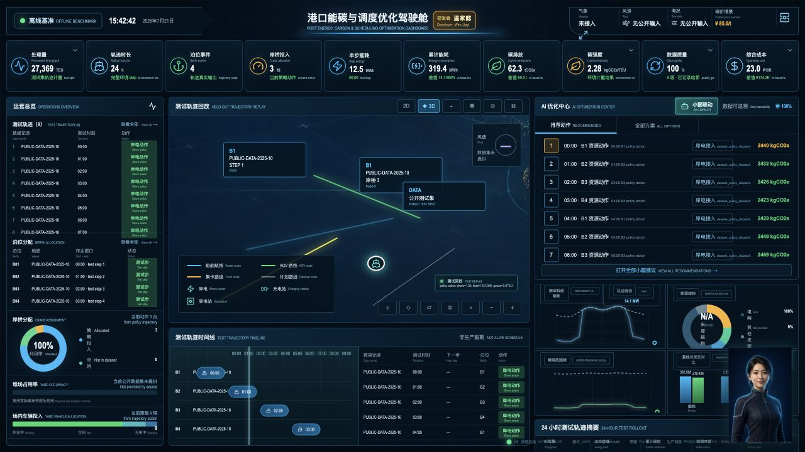
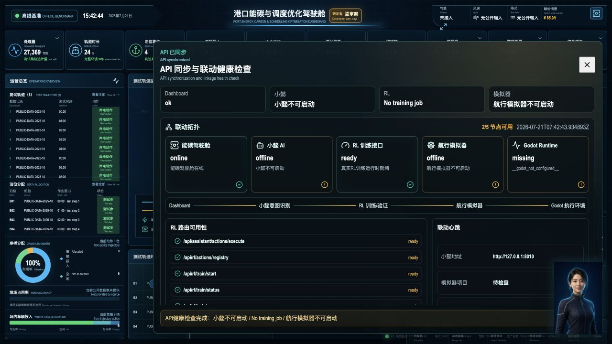
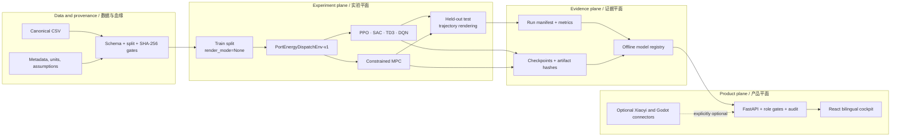

<div align="center">

# 港口能碳强化学习驾驶舱

## Port Energy-Carbon RL Cockpit

**面向港口能源、碳排与资源协同调度的可审计离线实验系统**<br>
**An auditable offline experimentation system for coordinated port energy, carbon, and resource dispatch**

[](https://github.com/wenjiayi123/port-energy-carbon-cockpit/actions/workflows/ci.yml)
[](https://github.com/wenjiayi123/port-energy-carbon-cockpit/actions/workflows/codeql.yml)
[](LICENSE)
[](backend/pyproject.toml)
[](frontend/package.json)
[](CHANGELOG.md)
[](docs/PRODUCTION_READINESS.md)

[快速开始](#快速开始--quick-start) · [系统架构](#系统架构--architecture) · [五类基线](#五类可执行基线--five-executable-baselines) · [数据契约](#替换港口数据--bring-your-own-port-data) · [可信边界](#可信边界--trust-boundaries) · [参与贡献](CONTRIBUTING.md)

</div>



> 截图来自仓库自带公开基准的留出测试轨迹。图中数值是可复现的离线场景输出，不是实时码头遥测、生产绩效或监管核证结果。<br>
> The screenshot is a held-out rollout from the bundled public benchmark. Values are reproducible offline scenario outputs—not live terminal telemetry, production performance, or regulatory assurance.

## 项目定位 / Project position

本项目把港口能耗、岸电、设备资源、延误、成本与碳排放放进同一个约束环境，连接数据校验、强化学习训练、控制理论对照、独立测试、轨迹回放、模型治理与双语驾驶舱。重点不是制造一张“看起来在线”的大屏，而是让每个关键数字都能回到数据分区、物理假设、算法动作和证据文件。

This project places port energy use, shore power, equipment allocation, delay, cost, and emissions inside one constrained environment. It connects dataset validation, reinforcement-learning training, a control-theory baseline, held-out evaluation, trajectory replay, model governance, and a bilingual cockpit. Its central goal is evidence: every important number should trace back to a split, a declared physical assumption, an algorithm action, and a persisted artifact.

### 为什么它不是普通大屏 / Why this is more than a dashboard

| 维度 / Dimension | 实际实现 / What is implemented |
| --- | --- |
| 实验内核 / Experiment core | Gymnasium `PortEnergyDispatchEnv-v1`，12 维归一化观测，连续三维资源动作或 27 个离散动作。 / A Gymnasium environment with 12 normalized observations and either three continuous controls or 27 explicit discrete actions. |
| 算法矩阵 / Algorithm matrix | PPO、SAC、TD3、DQN 四种 RL 算法，加三步有限时域约束 MPC。 / Four RL algorithms—PPO, SAC, TD3, DQN—plus a constrained three-step finite-horizon MPC baseline. |
| 训练边界 / Training boundary | 训练只读取 `train`，`render_mode=None`；完成后才在 `test` 上生成轨迹。 / Training reads only `train` with `render_mode=None`; trajectories are emitted only during post-training `test` evaluation. |
| 证据链 / Evidence chain | 配置、随机种子、CSV/元数据/组合包 SHA-256、回调指标、checkpoint、模型哈希、测试与验证结果。 / Config, seed, CSV/metadata/package SHA-256, callback metrics, checkpoints, model hash, evaluation, and verification evidence. |
| 碳核算 / Carbon accounting | 范围一辅助燃油与所在地法范围二分列；没有合同凭证时市场法范围二保持不可用。 / Scope 1 auxiliary fuel and location-based Scope 2 are separated; market-based Scope 2 remains unavailable without contractual instruments. |
| 安全边界 / Safety boundary | 生产调度硬编码禁用；外部连接器可选；变更接口需要角色权限和人工确认。 / Production dispatch is hard-disabled; external connectors are optional; mutation routes require role gates and explicit confirmation. |

## 可见系统 / What you can inspect

### 1. 留出轨迹驾驶舱 / Held-out trajectory cockpit

- 24 步测试轨迹、吞吐、岸桥/场内车辆动作、峰值负荷、能耗、范围一与范围二排放、成本与安全越界。
- 基线与策略对比来自同一环境、同一数据包与同一测试分区。
- 缺失的气象、AIS、TOS、堆场占用、AGV 电池与可再生能源结构直接显示“未接入”，不会生成展示性数字。

- A 24-step held-out trajectory with throughput, crane and yard-vehicle actions, peak load, energy, Scope 1/2 emissions, cost, and safety violations.
- Baseline and policy comparisons share the same environment, dataset package, and test partition.
- Missing weather, AIS, TOS, yard occupancy, AGV battery, and renewable-mix fields remain visibly unavailable instead of being fabricated.

### 2. 模型与联动治理 / Model and integration governance



治理面板区分驾驶舱、真实 learner 运行时、小懿 AI、本地航行模拟器和 Godot 执行环境。首次克隆时，只有仓库内能力显示就绪；未配置的外部桌面项目会明确离线。<br>
The governance panel separates the cockpit, real learner runtime, Xiaoyi AI, the local sailing simulator, and the Godot runtime. On a clean clone, only repository-owned capabilities report ready; unconfigured desktop integrations remain explicitly offline.

## 系统架构 / Architecture



| 层 / Layer | 技术 / Technology | 职责 / Responsibility |
| --- | --- | --- |
| 数据层 / Data | Pandas, canonical CSV, JSON metadata | 字段、单位、来源、分区、质量与漂移校验 / schema, units, provenance, split, quality, drift |
| 环境层 / Environment | Gymnasium, NumPy | 逐小时负荷、资源、排放、成本、延误与安全约束 / hourly load, resources, emissions, cost, delay, safety |
| 学习层 / Learning | Stable-Baselines3, PyTorch | 四种真实 learner、回调、暂停/恢复/停止与 checkpoint / four real learners, callbacks, controls, checkpoints |
| 对照层 / Control | constrained beam-search MPC | 可解释非 RL 基线 / interpretable non-RL baseline |
| 服务层 / Service | FastAPI, Pydantic | 实验、注册表、健康、指标、权限与审计 API / experiment, registry, health, metrics, authorization, audit APIs |
| 表现层 / Interface | React, TypeScript, Vite | 双语轨迹、场景推演、模型治理与可选联动 / bilingual trajectories, scenarios, governance, optional integrations |

## 五类可执行基线 / Five executable baselines

| ID | 家族 / Family | 动作空间 / Action space | 项目中的角色 / Role in this repository |
| --- | --- | --- | --- |
| `ppo` | RL | continuous | 裁剪策略梯度，用于连续资源配置。 / Clipped policy-gradient baseline for continuous allocation. |
| `sac` | RL | continuous | 熵正则离策略 actor-critic，适合岸电和设备比例。 / Entropy-regularized off-policy actor-critic for shore-power and equipment ratios. |
| `td3` | RL | continuous | 双评论家与延迟策略更新，强调平滑连续控制。 / Twin critics and delayed updates for smooth continuous control. |
| `dqn` | RL | 27 discrete presets | 在 3×3×3 可审计资源组合上做值学习。 / Value learning over an auditable 3×3×3 action grid. |
| `mpc` | control theory | 27-point grid | 三步有限时域、宽度 4 的约束束搜索；默认驾驶舱的可复现对照。 / Three-step constrained beam search with width 4; the reproducible default cockpit comparator. |

四种 RL 算法均通过 Stable-Baselines3 的实际 `learn()` 路径运行；仓库测试对每个 learner 执行最小 smoke run。smoke run 只证明管线可执行，不代表策略已收敛或优于基线。<br>
All four RL algorithms execute the actual Stable-Baselines3 `learn()` path, and the test suite performs a minimal smoke run for each learner. A smoke run proves pipeline executability—not convergence or superiority.

### 环境状态与目标 / Environment state and objective

观测包含需求、积压、网格碳因子、电价、燃油价、周期时间编码、进出口占比以及累计碳与延误预算。动作控制岸电接入比例、岸桥资源比例和场内车辆资源比例。每一步显式计算处理量、队列、负荷、峰值越界、辅助燃油、范围一/范围二排放、能耗成本和延误成本。

Observations include demand, backlog, grid carbon factor, electricity and fuel prices, cyclical time encoding, import/export shares, and accumulated carbon and delay budgets. Actions control shore-power, crane, and yard-resource ratios. Each step explicitly computes throughput, queue, load, peak violations, auxiliary fuel, Scope 1/2 emissions, energy cost, and delay cost.

## 可审计实验生命周期 / Auditable experiment lifecycle

```text
dataset validation
  -> immutable train/test split
  -> non-rendering fit or MPC construction
  -> callback metrics + checkpoints
  -> artifact SHA-256
  -> held-out test rollout
  -> drift, integrity, and safety gates
  -> candidate / validated_offline / verified_offline / blocked
  -> production_eligible = false
```

每个新 run 写入 `backend/app/data/runs/<job-id>/`，但运行目录和二进制模型默认不进入 Git。源码仓库保持轻量；需要公开的 benchmark 模型与结果应作为独立 release artifact 发布。<br>
Each new run is written to `backend/app/data/runs/<job-id>/`, while run outputs and binary models are ignored by Git. The source repository stays lightweight; benchmark models and results should be published as separate release artifacts.

| 证据文件 / Evidence | 内容 / Contents |
| --- | --- |
| `config.json` | 完整解析后的算法、数据、哈希、seed、超参数与边界 / resolved algorithm, data, hashes, seed, hyperparameters, boundaries |
| `metrics.jsonl` | learner callback 与非渲染验证指标 / learner callback and non-rendering validation metrics |
| `checkpoints/` | 基于真实 step 的阶段 checkpoint / measured-step checkpoints |
| `model.zip` / `mpc_policy.json` | 模型或控制器产物 / model or controller artifact |
| `manifest.json` | 生命周期、时长、产物路径与哈希 / lifecycle, duration, artifact reference and hash |
| `evaluation.json` | 留出集指标和可视化轨迹 / held-out metrics and trajectory |
| `verification.json` | 离线验证门槛与结论 / offline verification gates and outcome |

## 数据与碳核算 / Data and carbon accounting

默认 benchmark 组合了两类公开来源：

1. [Port of Los Angeles 2025 container statistics](https://www.portoflosangeles.org/business/statistics/container-statistics)：月度 TEU；训练为 1–9 月，测试为 10–12 月。
2. [U.S. EPA eGRID 2023 CAMX](https://www.epa.gov/egrid/summary-data)：429.983 lb/MWh 的总输出 CO2e 因子，换算为 0.19504 kg/kWh。

The default benchmark combines two public sources:

1. [Port of Los Angeles 2025 container statistics](https://www.portoflosangeles.org/business/statistics/container-statistics): monthly TEU, with January–September for training and October–December for testing.
2. [U.S. EPA eGRID 2023 CAMX](https://www.epa.gov/egrid/summary-data): the 429.983 lb/MWh total-output CO2e rate, converted to 0.19504 kg/kWh.

月度数据通过代码内公开的确定性小时曲线扩展为实验 episode。电价、燃油价、容量、设备负荷、延误成本和安全上限均是元数据中声明的 benchmark 假设，不是洛杉矶港公布的实测值。完整来源、单位和限制见 [数据卡](docs/DATA_CARD.md) 与 [dataset metadata](backend/app/data/datasets/port_la_2025_monthly.metadata.json)。<br>
Monthly observations are expanded into experiment episodes through a disclosed deterministic hourly profile. Electricity/fuel prices, capacities, equipment loads, delay cost, and safety limits are declared benchmark assumptions—not measurements published by the Port of Los Angeles. See the [data card](docs/DATA_CARD.md) and [dataset metadata](backend/app/data/datasets/port_la_2025_monthly.metadata.json).

## 快速开始 / Quick start

### 本地开发 / Local development

要求：Python 3.11+、Node.js 20+、pnpm。首次安装 PyTorch 可能需要数分钟。<br>
Requirements: Python 3.11+, Node.js 20+, and pnpm. The first PyTorch installation may take several minutes.

```bash
git clone https://github.com/wenjiayi123/port-energy-carbon-cockpit.git
cd port-energy-carbon-cockpit
make bootstrap
make demo
```

- 驾驶舱 / Cockpit: `http://127.0.0.1:5173/`
- OpenAPI: `http://127.0.0.1:8808/docs`
- Readiness: `http://127.0.0.1:8808/api/health/ready`
- Metrics: `http://127.0.0.1:8808/api/metrics`

### 加固容器 / Hardened containers

```bash
export OPERATOR_API_KEY="$(openssl rand -hex 24)"
make docker-up
```

Compose 将前后端绑定到 loopback，后端生产模式强制 API key；容器使用非 root 用户、只读文件系统、全部 capability drop 和独立 run/audit volume。面向互联网时仍应在前面配置 TLS、企业 SSO、每用户授权和集中式审计。<br>
Compose binds both services to loopback and enforces an API key in backend production mode. Containers use non-root users, read-only filesystems, dropped capabilities, and dedicated run/audit volumes. Internet-facing deployments still need TLS, enterprise SSO, per-user authorization, and centralized audit retention.

## 可复现实验 / Reproducible experiments

```bash
cd backend

# 列出四种 RL 与 MPC / list four RL algorithms plus MPC
.venv/bin/python -m app.rl.cli algorithms

# 验证数据契约和哈希 / validate dataset contract and hashes
.venv/bin/python -m app.rl.cli validate-data port_la_2025_monthly

# 仅在 train 上训练，不渲染 / fit on train only, without rendering
.venv/bin/python -m app.rl.cli train \
  --algorithm sac \
  --dataset port_la_2025_monthly \
  --total-steps 120000 \
  --seed 20260720

# 训练完成后才在 test 上评估并生成轨迹 / held-out evaluation after fitting
.venv/bin/python -m app.rl.cli evaluate --strategy auto:latest
```

API 启动训练需要 `confirm=true`。训练进度来自 `model.num_timesteps`、callback 指标和实际耗时；ETA 使用已测 step rate 推导，不使用固定时长计时器。<br>
API training requires `confirm=true`. Progress comes from `model.num_timesteps`, callback metrics, and measured elapsed time; ETA is derived from observed step rate, not a fixed-duration timer.

## 替换港口数据 / Bring your own port data

算法不绑定洛杉矶港。使用稳定 canonical schema 和相邻 metadata 即可替换数据，而不改 learner 或驾驶舱。完整字段、单位与时序模式见 [docs/DATASETS.md](docs/DATASETS.md)，模板见 [docs/examples/port_dataset_template.csv](docs/examples/port_dataset_template.csv)。<br>
Algorithms are not hard-coded to Los Angeles. Replace the data through the stable canonical schema and adjacent metadata without modifying the learner or cockpit. See [docs/DATASETS.md](docs/DATASETS.md) and the [CSV template](docs/examples/port_dataset_template.csv).

```bash
python scripts/prepare_port_dataset.py \
  --input /path/to/tos_ems_export.csv \
  --output backend/app/data/datasets/my_port.csv \
  --mapping /path/to/column_mapping.json \
  --source-id my_port_snapshot \
  --license proprietary-authorized

cd backend
.venv/bin/python -m app.rl.cli validate-data my_port
```

- `profiled_period`：适合公开月度/聚合 benchmark，按声明曲线构造 episode。 / for aggregate public benchmarks with a declared profile.
- `sequential_rows`：适合只读 TOS/EMS 小时快照，环境按不可变行推进。 / for immutable hourly TOS/EMS snapshots advanced row by row.
- CLI 可读取操作者明确提供的外部 CSV；HTTP API 只允许仓库已注册的数据集 ID，阻断任意文件路径访问。 / The CLI may read operator-supplied external CSV files; HTTP endpoints accept only registered dataset IDs and reject arbitrary filesystem paths.

## API 表面 / API surface

| Endpoint | 方法 / Method | 语义 / Semantics |
| --- | --- | --- |
| `/api/dashboard/snapshot` | GET | 当前公开 benchmark 与测试轨迹快照 / current benchmark and held-out snapshot |
| `/api/rl/capabilities` | GET | 算法、数据、运行时与渲染边界 / algorithms, datasets, runtime, rendering boundary |
| `/api/rl/datasets/validate` | POST | 注册数据集质量、分区与血缘校验 / registered-dataset quality, split, provenance validation |
| `/api/rl/train/start` | POST | 预览或确认启动真实 learner / preview or confirm a real learner run |
| `/api/rl/train/status` | GET | 实测 step、指标、速率、ETA 与状态 / measured steps, metrics, rate, ETA, state |
| `/api/rl/train/{pause,resume,stop}` | POST | callback 边界的训练控制 / callback-bound training control |
| `/api/rl/simulate` | POST | 保存策略的留出集评估与轨迹 / held-out evaluation and trajectory for a saved policy |
| `/api/rl/registry` | GET | 完整性、漂移、测试、验证与生命周期 / integrity, drift, test, verification, lifecycle |
| `/api/rlops/policies/verify` | POST | 持久化离线验证证据 / persist offline verification evidence |
| `/api/rl/dispatch` | POST | 仅生成 dry-run packet / produce a dry-run packet only |
| `/api/health/{live,ready}` | GET | 进程与依赖就绪检查 / process and dependency readiness |
| `/api/metrics` | GET | Prometheus 文本指标 / Prometheus text metrics |

完整交互 schema 以运行时 OpenAPI 为准。 / The runtime OpenAPI document is the authoritative interactive schema.

## 可信边界 / Trust boundaries

| 能力 / Capability | 仓库默认状态 / Default state | 不能据此声称 / What it does not prove |
| --- | --- | --- |
| 公开 TEU + eGRID benchmark | 已包含并记录来源 / bundled with provenance | 实时 TOS、EMS、AIS 或码头计量 / live TOS, EMS, AIS, or terminal meters |
| 确定性小时 episode | 可复现 / reproducible | 观测到的小时负荷曲线 / observed hourly demand |
| 四种真实 RL learner | 可执行、可产出模型 / executable and artifact-producing | 默认策略已经收敛或优于 MPC / default convergence or superiority |
| MPC 测试轨迹 | 默认可运行 / runnable by default | 生产调度建议已获批准 / production-approved recommendations |
| 策略验证 | 离线、留出集 / offline and held-out | 安全认证、型式认可或法规核证 / safety certification or regulatory assurance |
| 小懿 AI | 可选 HTTP 本地连接器 / optional local HTTP connector | 仓库自带外部知识库或云服务 / bundled external knowledge or cloud service |
| Godot 航行模拟器 | 可选桌面进程连接器 / optional desktop process connector | 训练证据或生产控制通道 / training evidence or a production control channel |
| 调度执行 | `dry_run=true`，生产资格恒为 false / dry-run only, eligibility always false | 自主设备控制 / autonomous equipment control |

在接入真实港口前，必须完成 TOS/EMS 只读适配、参数校准、计量血缘、身份权限、shadow mode、回滚演练、人工验收和独立安全联锁。完整门槛见 [生产就绪说明](docs/PRODUCTION_READINESS.md) 与 [威胁模型](docs/THREAT_MODEL.md)。<br>
Before a real-port integration, provide read-only TOS/EMS adapters, parameter calibration, meter lineage, identity controls, shadow mode, rollback drills, operator acceptance, and an independent safety interlock. See [production readiness](docs/PRODUCTION_READINESS.md) and the [threat model](docs/THREAT_MODEL.md).

## 安全与供应链 / Security and supply chain

- 生产模式拒绝无 `API_AUTH_MODE=api_key` 的启动，key 最少 24 字符；viewer/operator/admin 分级。
- 变更请求写入 mutation-only JSONL 审计；所有请求有 request ID、结构化访问日志和基础安全头。
- HTTP 数据集参数限制在注册目录，策略 ID 使用格式白名单，避免路径穿越。
- CI 包含 Ruff、backend/RL 测试、数据校验、前端构建、依赖审计与容器构建。
- CodeQL、Dependency Review 与 OpenSSF Scorecard 在仓库公开后启用；私有预审阶段保持跳过，避免 GitHub Free 私有功能门槛造成假失败。
- Actions 使用完整 commit SHA；Dependabot 按月分组，控制更新噪声。

- Production refuses to start without `API_AUTH_MODE=api_key`; keys require at least 24 characters and support viewer/operator/admin roles.
- Mutation requests are written to a JSONL audit stream; every request receives an ID, structured access log, and baseline security headers.
- HTTP dataset references are confined to the registry and strategy IDs are format-allowlisted against path traversal.
- CI covers Ruff, backend/RL tests, dataset validation, frontend build, dependency audits, and container builds.
- CodeQL, Dependency Review, and OpenSSF Scorecard activate after the repository becomes public; they remain skipped during private review to avoid false failures from GitHub Free private-feature limits.
- Actions are pinned to full commit SHAs; Dependabot updates are grouped monthly to control noise.

安全问题请按 [SECURITY.md](SECURITY.md) 私下报告。 / Report vulnerabilities privately according to [SECURITY.md](SECURITY.md).

## 质量门槛 / Quality gates

```bash
make test       # backend API, accounting, Gymnasium and five-baseline smoke tests
make build      # TypeScript + Vite production build
make validate   # repository structure and default dataset contract

cd backend
.venv/bin/python -m ruff check app
.venv/bin/python -m pip_audit

cd ../frontend
pnpm audit --audit-level high
```

> Intel macOS 仅能解析旧 PyTorch 2.2.2 wheel，当前已知漏洞使其只能作为兼容开发环境。安全发布门槛以 Linux CI/容器中解析的当前 PyTorch 版本为准，且不得加载不可信模型。<br>
> Intel macOS resolves only the legacy PyTorch 2.2.2 wheel; known vulnerabilities make it a compatibility-only development environment. The security release gate is the current Linux CI/container resolution, and untrusted model files must never be loaded.

## 仓库结构 / Repository map

```text
backend/app/
  api/          FastAPI routes and trust boundaries
  core/         configuration, security, observability
  rl/           dataset contract, catalog, environment, training service
  services/     carbon, market, KPI and dispatch simulation
  tests/        API, accounting, environment and learner smoke tests
frontend/src/   bilingual React cockpit and Xiaoyi linkage UI
configs/        declared carbon, KPI and port defaults
docs/           data/model cards, RL pipeline, threat model, production gate
scripts/        bootstrap, run, validation and dataset preparation
.github/        CI, security workflows, templates and dependency policy
```

## 深入文档 / Documentation

- [RL pipeline / 强化学习管线](docs/RL_PIPELINE.md)
- [Datasets and field contract / 数据与字段契约](docs/DATASETS.md)
- [Data card / 数据卡](docs/DATA_CARD.md)
- [Model card / 模型卡](docs/MODEL_CARD.md)
- [Module audit / 模块事实审计](docs/MODULE_AUDIT.md)
- [Production readiness / 生产就绪门槛](docs/PRODUCTION_READINESS.md)
- [Threat model / 威胁模型](docs/THREAT_MODEL.md)
- [Asset provenance / 视觉资产来源](docs/ASSET_PROVENANCE.md)
- [Open-source release checklist / 开源发布清单](docs/OPEN_SOURCE_CHECKLIST.md)

## 社区与治理 / Community and governance

- 提交代码前阅读 [CONTRIBUTING.md](CONTRIBUTING.md) 与 [CODE_OF_CONDUCT.md](CODE_OF_CONDUCT.md)。
- 路线图、维护者职责与决策流程见 [GOVERNANCE.md](GOVERNANCE.md)。
- 使用问题与支持边界见 [SUPPORT.md](SUPPORT.md)。
- 变更历史见 [CHANGELOG.md](CHANGELOG.md)。

- Read [CONTRIBUTING.md](CONTRIBUTING.md) and the [CODE_OF_CONDUCT.md](CODE_OF_CONDUCT.md) before contributing.
- Maintainer responsibilities and decisions are documented in [GOVERNANCE.md](GOVERNANCE.md).
- Support scope is documented in [SUPPORT.md](SUPPORT.md).
- Release history is tracked in [CHANGELOG.md](CHANGELOG.md).

## 许可证、数据与引用 / License, data, and citation

代码采用 [MIT License](LICENSE)。数据来源与 AI 辅助原创视觉资产的说明见 [THIRD_PARTY_NOTICES.md](THIRD_PARTY_NOTICES.md) 和 [ASSET_PROVENANCE.md](docs/ASSET_PROVENANCE.md)。Port of Los Angeles 名称与标识归其权利人所有；本项目与该港口不存在隶属或背书关系。<br>
Code is licensed under the [MIT License](LICENSE). Data attribution and AI-assisted original artwork provenance are documented in [THIRD_PARTY_NOTICES.md](THIRD_PARTY_NOTICES.md) and [ASSET_PROVENANCE.md](docs/ASSET_PROVENANCE.md). Port of Los Angeles names and marks remain with their owners; this project is not affiliated with or endorsed by the Port.

引用信息见 [CITATION.cff](CITATION.cff)。 / Citation metadata is available in [CITATION.cff](CITATION.cff).

---

<div align="center">

**Research-grade evidence, operator-grade visibility, production authority kept closed by design.**<br>
**研究级证据、操作级可视化，生产权限默认关闭。**

</div>
