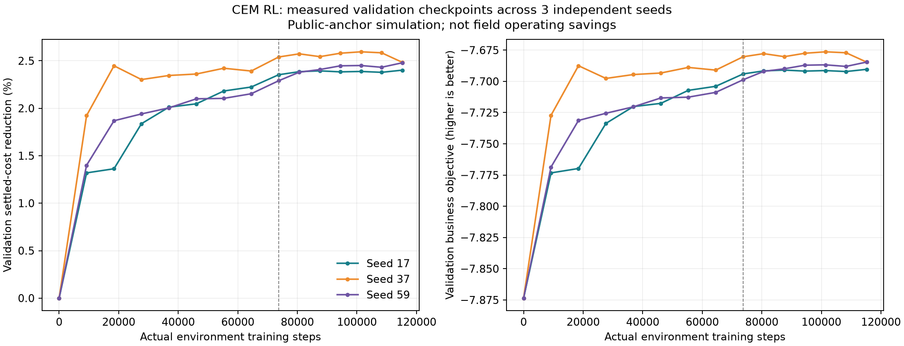

# v7 训练诊断、业务收益与策略切换

## 检查范围与原因

本次处理强化学习调度链。预测模块仍使用 `public-calibrated-causal-ridge-v1` 的独立误差评估，不把回归预测误差、优化求解结果和强化学习收敛混为一谈。物理约束、计量、监管放行和生产授权不交由强化学习决定。

原 v6 的三组 PPO 候选相对模型预测控制费用降低 0.5504%–0.8433%，同时碳排增加 1.1814%–1.9078%、吞吐下降 1.8471%–2.0645%、延误增加 20.0748%–28.8310%。原报告没有全局冠军，这个结论和所有历史制品保持不变。

定位到以下原因：

1. **参照策略过弱且动作不可达。** v6 快速控制器在队列为零时给出 0.72 的岸桥投入，残差幅度只有 0.12，因此最高 0.84，无法覆盖强对照策略的 1.0。残差学习并不自动保证包含强基线。
2. **必须履行的服务仍可被削减。** v6 学习动作可以降低岸电与需求响应承诺；总奖励改善并不保证合同服务不退化。
3. **排名目标与业务准入不一致。** 原调参优先考虑安全和总回报，最终业务门禁还要求碳、费用、吞吐、延误、峰值等共同通过。增加步数无法自动解决这个不一致。
4. **浮点误差误判为越界。** 验证窗口 5208、第 17 小时，`16660.000000000004 - 16660` 得到 `3.64e-12 kW`，原 `> 0` 判定触发安全惩罚。新环境只对最多 32 个浮点间距的误差修正分类，保留原始超额数值和全部实际能量流；0.001 kW 的真实超额仍被拒绝。
5. **训练回报与业务有效性必须分别证明。** 新的直接策略先在服务控制对照上改善，但独立测试仍有相对强模型预测控制的退化，因此该版本未晋级。后续加入相同状态下的参照保护，而没有把失败指标删除。

## 新训练与贡献归属

交叉熵方法在真实连续 24 小时模拟轨迹上搜索策略参数，用实际逐步累计的费用、碳排、安全和需求响应未交付成本计算回报。它是基于轨迹回报的强化学习策略搜索，不是监督模仿、预置曲线，也不是 PPO/SAC/TD3 神经网络。

策略有 11 个当前状态／时钟特征、55 个学习系数，调节岸桥投入、堆场投入、检查准备、放行后恢复优先级、储能功率五项动作。检查选择、正式扣留与正式放行仍为外生输入。六类作业优先级由确定性约束投影承担，不能把这些规则收益全部归功于学习器。

训练使用 2020–2022，检查点选择使用 2023。三组种子为 17、37、59，每组累计 115,200 步；第一次有效训练 73,728 步，继续训练 41,472 步。继续训练前已明确原因是种子 17 的验证回报尚未稳定，没有用测试收益调整模型参数。

预先设定的稳定标准为末四个验证检查点回报极差不超过其均值绝对值的 0.25%。最终三组分别为 0.022954%、0.107374%、0.045349%，均达到验证平台期。这个结论表示在当前训练协议下稳定，不是全局最优或实港长期稳定性证明。



最终执行先在模型预测控制的保护下应用验证集选出的固定策略，将该控制结果作为学习器的更强参照。对学习提出的完整方案与资源调整方案逐一预测，只有费用严格改善，且碳、负荷、吞吐、岸电、延误、需求响应以及储能库存和服务欠账均满足约束时才采用。否则回退参照策略。规则对照与固定参数对照使用相同的业务保护条件。

## 业务评估与证据

最终评估目录：[`dispatch_v7_qualified_attempt_01`](../reports/dispatch_v7_qualified_attempt_01/)。机器报告为该目录下的 `business_value.json`，逐窗结果为 `test_episodes.json`。训练系数和曲线位于 [`dispatch_v7_attempt_03`](../reports/dispatch_v7_attempt_03/)。

三组最终均通过全部准入检查。下表中的下降均相对相同窗口上的因果模型预测控制；费用包括终态补能结算。

| 随机种子 | 费用下降 | 碳排下降 | 延误下降 | 吞吐变化 | 相对强固定策略的额外费用下降 | 额外费用下降的 95% 配对区间 |
| --- | ---: | ---: | ---: | ---: | ---: | --- |
| 17 | 1.180643% | 0.142746% | 6.983540% | +0.119384% | 0.409684% | 0.3495%–0.4707% |
| **37 · 验证集选定** | **1.109073%** | **0.108833%** | **6.207399%** | **+0.036892%** | **0.337557%** | **0.2820%–0.3946%** |
| 59 | 0.936633% | 0.037404% | 5.845930% | +0.051828% | 0.163771% | 0.1318%–0.1992% |

三组安全越界、求解器越界、车辆离场缺电、冷藏箱温控越界均为零，岸电量与需求响应承诺均不退化。种子 37 的场景费用从参照均值 768,376.81 元／24 小时降至 759,854.95 元／24 小时，差额 8,521.86 元；其中相对强固定策略的增量单独核算，不将全部系统收益归因于学习。该金额是模拟账本的窗口均值，不做实港实际收益或年度收益外推。

在考虑海事检查、海关查验、监管等待及放行后作业恢复等因素的前提下，种子 37 相对因果模型预测控制仍降低情景费用 1.11%、作业延误 6.21%、岸桥任务逾期量 19.15% 和碳排 0.109%，同时保持吞吐及岸电服务不退化。相对强固定策略的费用均值 762,428.57 元／24 小时，额外节省 2,573.63 元／24 小时。监管等待与恢复已进入状态转移、费用、延误和附加能耗核算；这些是整体策略收益，不能单独归因为监管模块的因果收益。监管字段为可复现工程情景，尚未接入海事、海关真实业务数据；检查、扣留和正式放行仅作为外生事件输入，学习器只调整准备资源和恢复安排。

种子 17 的测试费用更低，当前指针仍选择验证集预先选出的种子 37，避免按最终测试排名更换冠军。当前指针为 [`dispatch_v7_current.json`](../reports/dispatch_v7_current.json)。

评估同时比较因果模型预测控制、相同保护下的非学习策略、在验证集上从十组参数中选择的固定策略。模型和固定策略均在打开最终测试前冻结。测试共 96 个互不重叠的 24 小时窗口，其中 48 个与 v6 原报告窗口不重叠；2024 曾用于 v6，必须称为回顾性回归评估，不能宣称新增独立年份或真实港口验证。

净费用明确包括电费、燃油、延误、储能衰减、需量费用与业务服务费用。期末储能缺口另按保守补能价格记入 `settled_cost`；原始费用与库存缺口同时保留。配对置信区间采用相同起始窗口。仅在三组种子同时满足收敛、业务不退化与相对每个对照至少 0.1% 的额外费用改善时准入。

训练回报中的碳优化偏好为 0.5 元／千克，属于已声明的工程权重。业务报表的费用改善使用实际模拟账本及终态补能结算，碳指标单列；落地时该偏好与真实电价、燃油价格和延误成本须按现场经营要求重新配置验证。

失败记录保留在 `dispatch_v7_attempt_01/diagnosis.json`、`dispatch_v7_attempt_02/business_value.json` 和 `dispatch_v7_guarded_attempt_01/business_value.json`，不得用后续结果覆盖。首个保护版本三组均优于原模型预测控制，但种子 37、59 未同时优于验证集选出的固定策略，所以该组也未晋级。原 v6 的代码、数据和模型哈希验证仍独立执行。

## 切换合同与落地边界

`DispatchSwitcherV7` 在同一个环境对象上替换策略，保留电池电量、普通队列、检查等待队列、放行恢复队列、冷藏箱热欠账、维护欠账以及累计计量。切换不会调用环境重置。模型文件在每次决策前检查哈希，损坏即回退；证据未准入、数据集指纹不一致或特征／动作合同不一致也会阻止切换。

接口为 `GET /api/rl/dispatch-v7/evidence` 和 `POST /api/rl/dispatch-v7/replay-switch`。前端路径为主页“证据”→“RL 策略”→“v7 训练收敛与业务收益”。72 小时回放按模型预测控制运行 12 小时、切换学习策略运行 36 小时、再回退运行 24 小时；回执逐次记录切换时状态是否完全保留。

本机验收已通过：72 小时完整回放、两次切换均保持全部状态、安全越界为零；决策计算耗时中位数约 302 毫秒、95 分位约 314 毫秒。完整回执见 [`dispatch_v7_cutover_acceptance_2026-09-07.json`](../reports/dispatch_v7_cutover_acceptance_2026-09-07.json)。该耗时只代表本机模拟计算，不代表现场网关与设备的端到端响应。

此切换样本的实际储能充放电量均为零，安全层限制了储能动作。已确认的经营改善主要来自资源和作业协调，不能据此声称验证了储能套利收益。储能库存连续性与能量守恒已核对，储能专项经济性仍需要具备有效调节空间的现场或独立场景验证。

这建立的是离线／影子环境内的策略替换合同。它没有把 v7 冒充为现有不同数据集上的实时策略，也没有接管任何现场设备。现场替换时继续沿用 `port-snapshot.v1`、数据集替换就绪评估和现有现场切换门禁：完成来源字段与单位映射、参数与计量标定、现场重新训练验证、独立影子验收后，可以复用相同策略接口。公开洛杉矶港参数不能无条件直接控制另一个港口。

四项边界保持：`simulation_mode=true`、`live_data_verified=false`、`dispatch_allowed=false`、`production_authority=false`。

## 本机工程验收

后端完整回归执行通过 216 项；最终策略切换适配器调整后，v7 专项 11 项再次通过，覆盖因果输入、缓存前后物理一致、浮点误判、真实越界、服务承诺、储能守恒、证据缺失和模型损坏回退。新代码静态检查和前端 TypeScript／Vite 构建通过；最终报告的 15 项来源、模型、业务门禁与边界校验全部通过，历史 v6 证据校验仍通过。

实际浏览器已完成读取训练证据、点击连续切换验证、等待最终异步回执的完整流程。最终显示“72 小时、状态连续 2/2、安全越界 0、已回退模型预测控制”，本次浏览器运行未发现控制台错误。该验收范围为本次新增模块，不代表全系统所有按钮及所有现场异常均已覆盖。

## 复现

```bash
make train-dispatch-v7
make refine-dispatch-v7
make evaluate-dispatch-v7
make verify-dispatch-v7
make verify-switch-v7
```

前三条默认写入独立 `dispatch_v7_reproduction*` 目录，目录已经存在时拒绝覆盖；可用 `V7_RUN_DIR`、`V7_REFINED_DIR`、`V7_EVAL_DIR`、`V7_QUALIFIED_DIR` 指定新目录。验证命令核验本次交付的冻结报告和当前策略指针。上述复现命令仅在本机训练和验证，不触发对外发布。

方法背景参照 [Stable-Baselines3 的训练与评估建议](https://stable-baselines3.readthedocs.io/en/master/guide/rl_tips.html) 和 [Residual Reinforcement Learning for Robot Control](https://arxiv.org/abs/1812.03201)。这些方法文献不能替代本项目的业务证据；实际收益以本地逐窗报告为准。
